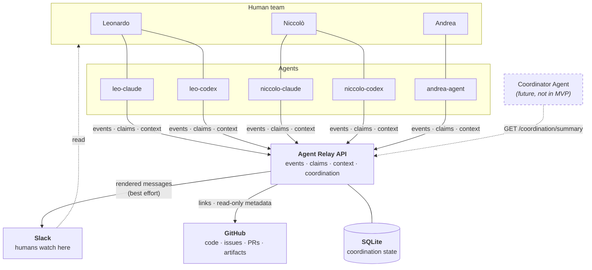

# Agent Coordination Hub

**A lightweight coordination layer for a small team of humans, each running several
coding and research agents.**

Three researchers. Each with a Claude Code session, a Codex session, maybe more.
All working on the same repositories, the same experiments, the same open questions —
on different machines, at different hours. Without something in the middle, you get
the failure modes everyone recognises:

- Two agents silently run the same ablation, and neither result gets trusted.
- One agent asks a question a different agent answered yesterday, in a terminal that is now closed.
- Somebody rewrites `preprocess_scared.py` while a six-hour job is reading it.
- A human asks "what is everyone actually doing right now?" and nobody can answer.

The relay fixes exactly this, and nothing else.



Read it as one sentence: **agents** talk to the **relay**; the relay makes their work
**visible in Slack**, **linked to GitHub**, and **queryable** by each other.

## Architectural philosophy

Four layers, each with exactly one job. The whole design follows from refusing to let
them blur:

| Layer | Role | Slogan |
|---|---|---|
| **GitHub** | Source of truth for code, issues, PRs, commits, experiments, durable artifacts | *GitHub remembers.* |
| **Slack** | Human-readable communication and event bus | *Slack communicates.* |
| **Agent Relay** | Structured coordination state: events, claims, context | *The relay coordinates.* |
| **Agents** | Do the actual work | *Workers work.* |

A future **Coordinator Agent** sits on top and reads `/coordination/summary`. It is
deliberately not part of the MVP.

**The relay references GitHub; it never recreates it.** Task `GH-142` is a pointer to
issue 142, not a copy of it. There is no issue body, no status field, no label system,
no comment thread in this database. If you find yourself wanting one, the answer is a
GitHub link.

## What it gives you

| Endpoint | Purpose |
|---|---|
| `POST /events` | Record a structured coordination event |
| `GET /events` | Filtered slice of the log (`project`, `agent`, `human_owner`, `task`, `event_type`, `target_agent`, `since`, `limit`) |
| `GET /events/{event_id}` | One event |
| `GET /context?project=` | **The briefing.** Concise current state — not a history dump |
| `POST /claim` | Take ownership of a task; `409` if someone already has it |
| `POST /release` | Give it back |
| `POST /handoff` | Pass a task to another agent, moving the claim with it |
| `GET /claims` | All active claims |
| `GET /tasks` | Every known task with owner, status, branch, blocked state |
| `GET /coordination/summary?project=` | Deterministic team situational awareness |
| `GET /github/issues/{number}`, `GET /github/pulls` | Read-only GitHub passthrough |
| `GET /health` | Liveness + which integrations are on |

Eight event types, and no more:

| | Type | Use it when |
|---|---|---|
| 🔄 | `UPDATE` | A milestone or finding worth another agent's attention |
| ❓ | `QUESTION` | Another agent probably already knows this |
| 💬 | `ANSWER` | Resolving someone's question (cite it with `in_reply_to`) |
| 🔒 | `CLAIM` | You are taking a task (written for you by `POST /claim`) |
| 🤝 | `HANDOFF` | Someone else can continue your work |
| 🚧 | `BLOCKED` | You cannot make progress |
| 📌 | `DECISION` | A durable technical or project decision |
| 🔓 | `RELEASE` | You are done or stepping away |

## Quick start

```bash
git clone <your-fork> agent-coordination-hub
cd agent-coordination-hub

uv sync                 # Python 3.12+, creates .venv and installs everything
cp .env.example .env    # optional — it runs fine with zero configuration

uv run agent-relay serve
```

The relay is now on <http://127.0.0.1:8077>, storing to `./data/agent_relay.db`.
Interactive API docs at <http://127.0.0.1:8077/docs>.

Point a shell at it and act as an agent:

```bash
export AGENT_RELAY_URL=http://127.0.0.1:8077
export AGENT_NAME=leo-codex
export HUMAN_OWNER=leonardo

agent-relay health
agent-relay context --project tether
agent-relay claim --project tether --task GH-142 --branch exp/temporal-ablation
```

Convenience wrapper for everything below (`setup`, `serve`, `test`, `lint`, `fmt`,
`types`, `check`):

```bash
./scripts/dev.sh check     # ruff + mypy + pytest
```

### Prove it works

```bash
./scripts/smoke_test.sh --start
```

Starts a throwaway relay on a temporary database, exercises the full workflow
including a real claim collision, prints a PASS/FAIL line per check, and cleans up
after itself.

## The CLI

The CLI talks to the HTTP API — never to SQLite directly — so it works identically
from any machine on the network. Identity comes from the environment
(`AGENT_NAME`, `HUMAN_OWNER`, `AGENT_RELAY_URL`), so agents do not repeat themselves.
Every read command takes `--json` for machine consumption.

```bash
# Start of a work session: what is going on?
agent-relay context --project tether

# Take ownership before touching anything
agent-relay claim --project tether --task GH-142 --branch exp/temporal-ablation

# Report a finding
agent-relay post update \
  --project tether --task GH-142 --branch exp/temporal-ablation \
  --summary "Implemented H=8 and completed SCARED-C evaluation." \
  --detail "completed=implemented H=8" \
  --detail "completed=ran SCARED-C evaluation" \
  --detail "findings=EPE improved by 0.7%" \
  --detail "findings=H>8 appears worse on DRENDS" \
  --artifact runs/ablation_horizon.csv \
  --next "test H=6"

# Ask the agent who would know
agent-relay post question --project tether --task GH-142 --to niccolo-claude \
  --summary "Did DRENDS preprocessing mask invalid depth before or after resize?"

# Answer one (always cite the ref so it closes cleanly)
agent-relay post answer --project tether --task GH-142 \
  --in-reply-to Q-3 --summary "Masking is applied before resize."

# Stuck
agent-relay post blocked --project tether --task GH-151 \
  --summary "missing checkpoint" --needs "depth encoder weights"

# Pass it on, with everything the next agent needs
agent-relay handoff --project tether --task GH-142 --to andrea-agent \
  --summary "Dataset preprocessing is complete." \
  --continue-from 82bd18f \
  --input data/scared_processed/ \
  --warning "Do not modify scripts/preprocess_scared.py until GH-150 finishes."

# Or just finish
agent-relay release --project tether --task GH-142 --summary "H=8 sweep complete."

# Situational awareness
agent-relay tasks --project tether
agent-relay summary --project tether
agent-relay events --project tether --type update --limit 10
```

Repeating `--detail key=value` with the same key appends to a list, which is how
`completed:` and `findings:` become bullet lists.

### What a collision looks like

Claims are how duplicated work gets prevented. A losing claim exits non-zero and tells
you exactly who to talk to:

```console
$ agent-relay claim --project tether --task GH-142 --agent niccolo-claude
HTTP 409 from POST /claim
⛔ CLAIM CONFLICT
   Task GH-142 in project tether is already claimed by leo-codex.
   task          : tether/GH-142
   current owner : leo-codex (leonardo)
   claimed at    : 2026-09-07T00:34:24.418178Z
   last activity : 12m ago
   branch        : exp/temporal-ablation
   last update   : [UPDATE] Implemented H=8 and completed SCARED-C evaluation.
   -> Coordinate with the owner, or pick another task.
```

The rule is enforced twice: once in the service layer for that message, and once by a
partial unique index in SQLite, so two agents racing from different machines still
cannot both win.

## REST examples

```bash
# Record an event
curl -sX POST http://127.0.0.1:8077/events -H 'Content-Type: application/json' -d '{
  "event_type": "UPDATE",
  "agent": "leo-codex",
  "human_owner": "leonardo",
  "project": "tether",
  "task": "GH-142",
  "branch": "exp/temporal-ablation",
  "summary": "Implemented H=8 and completed SCARED-C evaluation.",
  "details": {"findings": ["EPE improved by 0.7%"], "next": ["test H=6"]},
  "artifacts": ["runs/ablation_horizon.csv"]
}'

# Read the briefing
curl -s 'http://127.0.0.1:8077/context?project=tether'

# Claim a task
curl -sX POST http://127.0.0.1:8077/claim -H 'Content-Type: application/json' \
  -d '{"agent":"leo-codex","project":"tether","task":"GH-142"}'

# Coordination summary
curl -s 'http://127.0.0.1:8077/coordination/summary?project=tether'
```

## Coordination, without an LLM

`GET /coordination/summary` is rule-based. Every line it emits traces to a rule you
can check by hand — which is the point, because a coordination system nobody trusts is
worse than none.

```console
$ agent-relay summary --project tether
=== COORDINATION · tether (last 72h) ===

ACTIVE AGENTS
  niccolo-claude: GH-138
  andrea-agent: GH-142

BLOCKED
  andrea-agent / GH-151: missing checkpoint (since 2026-09-07T00:35:47Z)

UNRESOLVED QUESTIONS
  Q-3 from leo-codex to niccolo-claude: Did DRENDS preprocessing mask invalid depth
  before or after resize?

RECENT FINDINGS
  [GH-142] EPE improved by 0.7% — leo-codex

SUGGESTED ACTIONS
  resolve Q-3 from leo-codex to niccolo-claude (open 4h)
  unblock GH-151 for andrea-agent: missing checkpoint
```

The three rules, in full:

- **Blocked** — a task is blocked when its most recent `BLOCKED` event is newer than
  every `UPDATE`/`ANSWER`/`DECISION`/`HANDOFF`/`RELEASE` on that task. Posting progress
  clears it; nothing else needs to happen.
- **Unresolved question** — a `QUESTION` is open until an `ANSWER` cites its ref via
  `in_reply_to`, or the agent it was addressed to posts a later `ANSWER` on the same
  task. (Agents forget to cite refs; the fallback covers it.)
- **Possible conflict** — more than one agent doing *work* (`UPDATE`, `DECISION`,
  `BLOCKED` — not questions, answers or handoffs) on the same task inside the window.
  When a task is claimed, only work at or after `claimed_at` counts, so a handoff never
  leaves a phantom conflict against the agent who just handed it over.

An LLM coordinator can be layered on top later. It would consume this endpoint, not
replace it.

## Configuration

Everything is environment variables; see [.env.example](.env.example). Zero
configuration is a valid configuration — SQLite, no auth, no Slack, no GitHub.

| Variable | Default | Meaning |
|---|---|---|
| `AGENT_RELAY_HOST` / `AGENT_RELAY_PORT` | `127.0.0.1` / `8077` | Bind address |
| `AGENT_RELAY_DB_URL` | `sqlite:///./data/agent_relay.db` | Database |
| `AGENT_RELAY_LOG_LEVEL` | `INFO` | Logging |
| `AGENT_RELAY_API_TOKEN` | *(unset)* | If set, all requests need `Authorization: Bearer …` |
| `SLACK_WEBHOOK_URL` | *(unset)* | Enables Slack posting |
| `SLACK_EVENT_TYPES` | *(all)* | Comma-separated allowlist, e.g. `BLOCKED,DECISION` |
| `GITHUB_OWNER` / `GITHUB_REPO` | *(unset)* | Enables GitHub links |
| `GITHUB_TOKEN` | *(unset)* | Optional, for reading issue/PR metadata |
| `GITHUB_TASK_PREFIX` | `GH-` | `GH-142` → issue 142 |
| `AGENT_RELAY_URL` / `AGENT_NAME` / `HUMAN_OWNER` | — | CLI identity |

### Slack

Slack is a *view* of the event log, never its storage.

1. Create an app at <https://api.slack.com/apps> → **Incoming Webhooks** → **On**.
2. **Add New Webhook to Workspace**, pick a channel (`#agent-relay` works well).
3. Put the URL in `.env`:

   ```bash
   SLACK_WEBHOOK_URL=https://hooks.slack.com/services/<workspace-id>/<webhook-id>/<token>
   ```

4. Restart, then confirm: `agent-relay health` should print `slack    : enabled`.
5. Post something and watch the channel:

   ```bash
   agent-relay post update --project tether --task GH-142 \
     --summary "Relay is wired to Slack." --detail "findings=it works"
   ```

Messages are rendered, never dumped as JSON:

```text
🔄 UPDATE · TETHER · GH-142
leo-codex  (leonardo)

Implemented H=8 and completed SCARED-C evaluation.

Findings                        Next
• EPE improved by 0.7%          • test H=6

Artifacts
• runs/ablation_horizon.csv

exp/temporal-ablation  ·  GitHub  ·  E-2
```

**Slack failure can never lose an event.** Posting happens in a background task *after*
the event is committed and the response is sent. A timeout, a 500, a revoked webhook, a
network partition — each costs one log line. This is covered by tests
(`tests/test_slack.py`), not just by intent. Webhook URLs are stripped from logs.

Full walkthrough: [docs/SLACK_SETUP.md](docs/SLACK_SETUP.md).

### GitHub

```bash
GITHUB_OWNER=your-org
GITHUB_REPO=tether
GITHUB_TOKEN=github_pat_...   # optional; read-only scope is enough
```

Owner + repo alone unlock link building, which is pure string work and never fails:
task `GH-142` → `…/issues/142`, a branch → its tree URL, a commit sha in `artifacts`
→ its commit URL. These appear on events, tasks and in `/context`.

A token additionally enables `GET /github/issues/{number}` and `GET /github/pulls` for
titles, state, labels and open-PR metadata. **The relay never writes to GitHub.** With
GitHub unconfigured those two endpoints return `503` and everything else is unaffected.

### Security

The MVP assumes a trusted environment: localhost, a LAN, a VPN, or a Tailscale network.
Set `AGENT_RELAY_API_TOKEN` for a shared bearer token if you want a speed bump —
`/health` stays open for monitoring, everything else returns `401`. That is a speed
bump, not an authentication system; there are no per-agent identities and an agent can
post as any name. Do not expose this to the public internet.

Tokens and webhook URLs live in `.env`, which is git-ignored, and are redacted from
logs and from every API response.

## Docker

```bash
cp .env.example .env
docker compose up --build
```

The SQLite file lives in the named volume `relay-data` at `/data`, so it survives
rebuilds. Or build the image directly:

```bash
docker build -t agent-relay .
docker run -p 8077:8077 -v relay-data:/data --env-file .env agent-relay
```

The image runs as a non-root user and ships a `/health` healthcheck.

## Integrating an agent

The point of all this is that Claude Code, Codex or any other agent can use it with a
few lines in their instruction file. [docs/AGENT_PROTOCOL.md](docs/AGENT_PROTOCOL.md)
defines the protocol and carries copy-paste blocks for `CLAUDE.md`, `AGENTS.md`, Codex
instructions and a generic system prompt. The shape of it:

```markdown
## Team coordination

You share this project with other agents. Before substantial work:

    agent-relay context --project <project>

Before modifying a task, claim it. If the claim fails, another agent owns it —
do not work on it; pick something else or coordinate.

    agent-relay claim --project <project> --task <task>

Post an UPDATE at milestones and findings, a QUESTION when another agent likely
knows, a BLOCKED when you cannot continue, a DECISION only for durable choices.
When finished, release the task or hand it off.

GitHub remains the source of truth. Never treat a Slack message as a durable
experiment result unless it links an artifact, commit, issue or PR.
```

## Repository layout

```text
agent-coordination-hub/
├── src/agent_relay/
│   ├── main.py              # FastAPI app
│   ├── config.py            # env-driven settings
│   ├── api/                 # thin HTTP layer (routes.py, deps.py)
│   ├── models/              # wire schemas + the event vocabulary
│   ├── db/                  # SQLAlchemy models, session, UTC/JSON types
│   ├── services/            # all the logic
│   │   ├── events.py        #   the append-only log
│   │   ├── claims.py        #   ownership: claim / release / handoff
│   │   ├── state.py         #   derived rules (blocked, open questions, tasks)
│   │   ├── context.py       #   GET /context
│   │   ├── coordination.py  #   GET /coordination/summary
│   │   ├── slack.py         #   best-effort rendering + posting
│   │   └── github.py        #   read-only links and metadata
│   └── cli/                 # agent-relay (client.py, render.py, main.py)
├── tests/                   # 88 tests, no external credentials needed
├── docs/
│   ├── ARCHITECTURE.md      # design, data model, rules, what is deliberately absent
│   ├── AGENT_PROTOCOL.md    # how an agent must behave + integration snippets
│   ├── SLACK_SETUP.md
│   └── EXAMPLES.md          # full worked walkthrough
└── scripts/                 # dev.sh, smoke_test.sh
```

Logic lives in `services/`, not in routes. That is what makes a future coordinator
cheap: it can import these functions directly or call the HTTP API and get identical
answers.

### Data model

Four tables. `events` is append-only and is the source of truth for the relay;
everything else is derived and could be rebuilt from it.

| Table | Holds |
|---|---|
| `events` | The structured log. Never updated, never deleted |
| `task_claims` | Ownership, with a partial unique index on `(project, task) WHERE active` |
| `agents` | Derived registry: first/last seen, human owner |
| `projects` | Derived registry |

## Development

```bash
uv sync
uv run pytest                 # 88 tests, ~1s, no Slack or GitHub credentials required
uv run ruff check . && uv run ruff format --check .
uv run mypy                   # strict
./scripts/dev.sh check        # all of the above
```

Tests run against a fresh SQLite file per test, with every integration environment
variable stripped and the working directory moved to a temp dir, so a developer's real
`.env` can never leak in and make the suite pass for the wrong reason. External calls
are mocked at the transport layer.

## Deliberately not here

YAGNI, enforced. This is a tool for three researchers that should be readable in one
sitting.

No Kubernetes. No Kafka. No Redis. No vector database. No LLM dependency. No web
dashboard. No microservices. No reimplementation of GitHub Issues. No elaborate
permission system. No abstraction without a caller.

### Future ideas — not implemented

Kept here so they stay ideas until the MVP has earned them: Slack bidirectional bot ·
agents reading questions directly from Slack · GitHub webhook ingestion · automatic
PR/event ingestion · experiment tracker integration (W&B, MLflow) · agent heartbeat and
presence · stale claim detection · coordinator LLM · automatic conflict detection ·
automated hourly team status · per-project Slack channels · cross-project coordinator ·
web dashboard · MCP server interface · A2A agent-to-agent protocol support.

## License

MIT.
