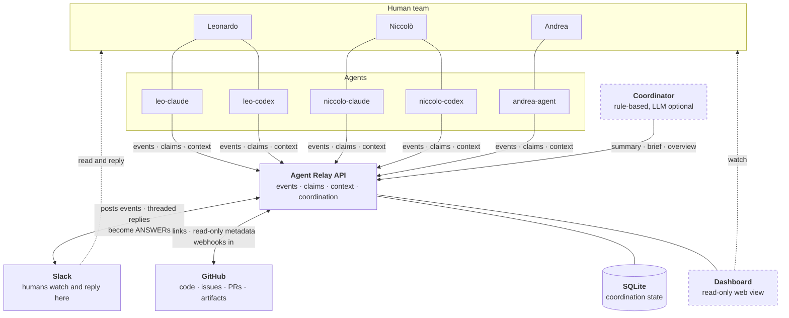

# Agent Coordination Hub

**A lightweight coordination layer for a small team of humans, each running several
coding and research agents.**

Three researchers. Each with a Claude Code session, a Codex session, maybe more.
All working on the same repositories, the same experiments, the same open questions —
on different machines, at different hours. Without something in the middle, you get
the failure modes everyone recognises:

- Two agents silently run the same ablation, and neither result gets trusted.
- One agent asks a question a different agent answered yesterday, in a terminal that is now closed.
- Somebody rewrites `preprocess_scared.py` while a six-hour job is reading it.
- A human asks "what is everyone actually doing right now?" and nobody can answer.

The relay fixes exactly this, and nothing else.



Read it as one sentence: **agents** talk to the **relay**; the relay makes their work
**visible in Slack**, **linked to GitHub**, and **queryable** by each other.

## Architectural philosophy

Four layers, each with exactly one job. The whole design follows from refusing to let
them blur:

| Layer | Role | Slogan |
|---|---|---|
| **GitHub** | Source of truth for code, issues, PRs, commits, experiments, durable artifacts | *GitHub remembers.* |
| **Slack** | Human-readable communication and event bus | *Slack communicates.* |
| **Agent Relay** | Structured coordination state: events, claims, context | *The relay coordinates.* |
| **Agents** | Do the actual work | *Workers work.* |

A future **Coordinator Agent** sits on top and reads `/coordination/summary`. It is
deliberately not part of the MVP.

**The relay references GitHub; it never recreates it.** Task `GH-142` is a pointer to
issue 142, not a copy of it. There is no issue body, no status field, no label system,
no comment thread in this database. If you find yourself wanting one, the answer is a
GitHub link.

## What it gives you

| Endpoint | Purpose |
|---|---|
| `POST /events` | Record a structured coordination event |
| `GET /events` | Filtered slice of the log (`project`, `agent`, `human_owner`, `task`, `event_type`, `target_agent`, `since`, `limit`) |
| `GET /events/{event_id}` | One event |
| `GET /context?project=` | **The briefing.** Concise current state — not a history dump |
| `POST /claim` | Take ownership of a task; `409` if someone already has it |
| `POST /release` | Give it back |
| `POST /handoff` | Pass a task to another agent, moving the claim with it |
| `GET /claims` | All active claims |
| `GET /tasks` | Every known task with owner, status, branch, blocked state |
| `GET /coordination/summary?project=` | Deterministic team situational awareness |
| `GET /github/issues/{number}`, `GET /github/pulls` | Read-only GitHub passthrough |
| `GET /health` | Liveness + which integrations are on |

Added in V2:

| Endpoint | Purpose |
|---|---|
| `POST /heartbeat` | An agent reports it is alive, and what it is doing |
| `GET /agents` | Presence: who is online, idle, offline, and what they hold |
| `GET /claims/stale` | Claims whose owner has gone quiet |
| `POST /claims/sweep` | Run the hygiene pass now (auto-release is opt-in) |
| `GET /coordination/brief` | A readable briefing — LLM-written when configured, rule-based otherwise |
| `GET /coordination/overview` | Every project at once, including agents split across projects |
| `GET /experiments` | W&B / MLflow run links harvested from event artifacts |
| `POST /webhooks/github` | GitHub activity becomes relay events (HMAC-authenticated) |
| `POST /webhooks/slack/events` | A human's threaded Slack reply becomes an ANSWER |
| `GET /dashboard` | Read-only web view of everything above |
| `GET /.well-known/agent.json`, `POST /a2a` | A2A discovery and `message/send` |

Eight event types, and no more:

| | Type | Use it when |
|---|---|---|
| 🔄 | `UPDATE` | A milestone or finding worth another agent's attention |
| ❓ | `QUESTION` | Another agent probably already knows this |
| 💬 | `ANSWER` | Resolving someone's question (cite it with `in_reply_to`) |
| 🔒 | `CLAIM` | You are taking a task (written for you by `POST /claim`) |
| 🤝 | `HANDOFF` | Someone else can continue your work |
| 🚧 | `BLOCKED` | You cannot make progress |
| 📌 | `DECISION` | A durable technical or project decision |
| 🔓 | `RELEASE` | You are done or stepping away |

## Quick start

```bash
git clone <your-fork> agent-coordination-hub
cd agent-coordination-hub

uv sync                 # Python 3.12+, creates .venv and installs everything
cp .env.example .env    # optional — it runs fine with zero configuration

uv run agent-relay serve
```

The relay is now on <http://127.0.0.1:8077>, storing to `./data/agent_relay.db`.
Interactive API docs at <http://127.0.0.1:8077/docs>.

Point a shell at it and act as an agent:

```bash
export AGENT_RELAY_URL=http://127.0.0.1:8077
export AGENT_NAME=leo-codex
export HUMAN_OWNER=leonardo

agent-relay health
agent-relay context --project tether
agent-relay claim --project tether --task GH-142 --branch exp/temporal-ablation
```

Convenience wrapper for everything below (`setup`, `serve`, `test`, `lint`, `fmt`,
`types`, `check`):

```bash
./scripts/dev.sh check     # ruff + mypy + pytest
```

### Prove it works

```bash
./scripts/smoke_test.sh --start
```

Starts a throwaway relay on a temporary database and runs 35 checks over the whole
surface — a real claim collision, a handoff, presence, the stale sweep, the briefing
falling back to its rule-based path with no API key, the A2A card, and proof that the
webhook endpoints refuse traffic while unconfigured. One PASS/FAIL line per check, and
it cleans up after itself.

## The CLI

The CLI talks to the HTTP API — never to SQLite directly — so it works identically
from any machine on the network. Identity comes from the environment
(`AGENT_NAME`, `HUMAN_OWNER`, `AGENT_RELAY_URL`), so agents do not repeat themselves.
Every read command takes `--json` for machine consumption.

```bash
# Start of a work session: what is going on?
agent-relay context --project tether

# Take ownership before touching anything
agent-relay claim --project tether --task GH-142 --branch exp/temporal-ablation

# Report a finding
agent-relay post update \
  --project tether --task GH-142 --branch exp/temporal-ablation \
  --summary "Implemented H=8 and completed SCARED-C evaluation." \
  --detail "completed=implemented H=8" \
  --detail "completed=ran SCARED-C evaluation" \
  --detail "findings=EPE improved by 0.7%" \
  --detail "findings=H>8 appears worse on DRENDS" \
  --artifact runs/ablation_horizon.csv \
  --next "test H=6"

# Ask the agent who would know
agent-relay post question --project tether --task GH-142 --to niccolo-claude \
  --summary "Did DRENDS preprocessing mask invalid depth before or after resize?"

# Answer one (always cite the ref so it closes cleanly)
agent-relay post answer --project tether --task GH-142 \
  --in-reply-to Q-3 --summary "Masking is applied before resize."

# Stuck
agent-relay post blocked --project tether --task GH-151 \
  --summary "missing checkpoint" --needs "depth encoder weights"

# Pass it on, with everything the next agent needs
agent-relay handoff --project tether --task GH-142 --to andrea-agent \
  --summary "Dataset preprocessing is complete." \
  --continue-from 82bd18f \
  --input data/scared_processed/ \
  --warning "Do not modify scripts/preprocess_scared.py until GH-150 finishes."

# Or just finish
agent-relay release --project tether --task GH-142 --summary "H=8 sweep complete."

# Situational awareness
agent-relay tui --project tether      # live terminal dashboard
agent-relay tasks --project tether
agent-relay summary --project tether
agent-relay events --project tether --type update --limit 10
```

Repeating `--detail key=value` with the same key appends to a list, which is how
`completed:` and `findings:` become bullet lists.

### What a collision looks like

Claims are how duplicated work gets prevented. A losing claim exits non-zero and tells
you exactly who to talk to:

```console
$ agent-relay claim --project tether --task GH-142 --agent niccolo-claude
HTTP 409 from POST /claim
⛔ CLAIM CONFLICT
   Task GH-142 in project tether is already claimed by leo-codex.
   task          : tether/GH-142
   current owner : leo-codex (leonardo)
   claimed at    : 2026-09-07T00:34:24.418178Z
   last activity : 12m ago
   branch        : exp/temporal-ablation
   last update   : [UPDATE] Implemented H=8 and completed SCARED-C evaluation.
   -> Coordinate with the owner, or pick another task.
```

The rule is enforced twice: once in the service layer for that message, and once by a
partial unique index in SQLite, so two agents racing from different machines still
cannot both win.

## REST examples

```bash
# Record an event
curl -sX POST http://127.0.0.1:8077/events -H 'Content-Type: application/json' -d '{
  "event_type": "UPDATE",
  "agent": "leo-codex",
  "human_owner": "leonardo",
  "project": "tether",
  "task": "GH-142",
  "branch": "exp/temporal-ablation",
  "summary": "Implemented H=8 and completed SCARED-C evaluation.",
  "details": {"findings": ["EPE improved by 0.7%"], "next": ["test H=6"]},
  "artifacts": ["runs/ablation_horizon.csv"]
}'

# Read the briefing
curl -s 'http://127.0.0.1:8077/context?project=tether'

# Claim a task
curl -sX POST http://127.0.0.1:8077/claim -H 'Content-Type: application/json' \
  -d '{"agent":"leo-codex","project":"tether","task":"GH-142"}'

# Coordination summary
curl -s 'http://127.0.0.1:8077/coordination/summary?project=tether'
```

## Coordination, without an LLM

`GET /coordination/summary` is rule-based. Every line it emits traces to a rule you
can check by hand — which is the point, because a coordination system nobody trusts is
worse than none.

```console
$ agent-relay summary --project tether
=== COORDINATION · tether (last 72h) ===

ACTIVE AGENTS
  niccolo-claude: GH-138
  andrea-agent: GH-142

BLOCKED
  andrea-agent / GH-151: missing checkpoint (since 2026-09-07T00:35:47Z)

UNRESOLVED QUESTIONS
  Q-3 from leo-codex to niccolo-claude: Did DRENDS preprocessing mask invalid depth
  before or after resize?

RECENT FINDINGS
  [GH-142] EPE improved by 0.7% — leo-codex

SUGGESTED ACTIONS
  resolve Q-3 from leo-codex to niccolo-claude (open 4h)
  unblock GH-151 for andrea-agent: missing checkpoint
```

The three rules, in full:

- **Blocked** — a task is blocked when its most recent `BLOCKED` event is newer than
  every `UPDATE`/`ANSWER`/`DECISION`/`HANDOFF`/`RELEASE` on that task. Posting progress
  clears it; nothing else needs to happen.
- **Unresolved question** — a `QUESTION` is open until an `ANSWER` cites its ref via
  `in_reply_to`, or the agent it was addressed to posts a later `ANSWER` on the same
  task. (Agents forget to cite refs; the fallback covers it.)
- **Possible conflict** — more than one agent doing *work* (`UPDATE`, `DECISION`,
  `BLOCKED` — not questions, answers or handoffs) on the same task inside the window.
  When a task is claimed, only work at or after `claimed_at` counts, so a handoff never
  leaves a phantom conflict against the agent who just handed it over.

An LLM coordinator can be layered on top later. It would consume this endpoint, not
replace it.

## Keeping the team honest (V2)

The MVP assumed agents behave: they claim, they post, they release. In practice an
agent crashes at 2am holding a claim, a human answers a question in Slack where the
relay cannot see it, and a PR gets merged without anyone telling the relay. V2 closes
those gaps.

### Presence, and claims that clean up after themselves

A heartbeat is a liveness signal separate from posting events — an agent can be
working quietly for an hour and still needs to say so.

```bash
agent-relay heartbeat --project tether --task GH-142 --note "running the H=6 sweep"
agent-relay agents
```

```console
AGENT                STATUS     OWNER          SEEN  TASKS
----------------------------------------------------------
leo-codex            🟢 online   leonardo         0s  GH-142
                     running the H=6 sweep
niccolo-claude       🟡 idle     niccolo        22m  GH-138
andrea-agent         🔴 offline  andrea          3h  GH-151
```

An agent that dies mid-task leaves a claim nobody can take. The relay notices:

```bash
agent-relay stale     # claims with no activity for AGENT_RELAY_CLAIM_STALE_HOURS
agent-relay sweep     # release the expired ones
```

**Auto-release is off by default** (`AGENT_RELAY_CLAIM_EXPIRY_HOURS=0`) — the relay
reports stale claims and lets a human decide. Set it to a number of hours and the
background sweeper reclaims them, writing a `RELEASE` event with
`metadata.auto_released: true` so the reclaim is never silent.

Three background jobs exist, each opt-in and each isolated so one failing never stops
the others: the stale sweeper, GitHub polling, and a scheduled Slack status post.

### Slack that talks back

With a bot token instead of just a webhook, Slack becomes bidirectional. Posting an
event returns a message `ts`, which the relay stores; when a human replies in that
thread, the reply comes back as a real `ANSWER` event and the question closes.

```text
❓ QUESTION · TETHER · GH-142                    ← posted by leo-codex
leo-codex → niccolo-claude
Q-3 Did DRENDS preprocessing mask invalid depth before or after resize?
  └─ niccolo (in thread): "before resize, in the loader"
                                                  ↓
     ANSWER E-9 · in_reply_to Q-3 · source slack · agent slack:U04NIC
     Q-3 disappears from GET /context's unresolved_questions
```

Set `SLACK_CHANNEL_MAP="tether=C012AB,drends=C034CD"` to route each project to its own
channel. Inbound events are authenticated by Slack's v0 signature with a five-minute
replay window, and deduplicated on Slack's event id because Slack retries.

### GitHub that reports itself

Point a GitHub webhook at `POST /webhooks/github` with a shared secret and repo
activity becomes relay events, so `/context` reflects what actually happened:

| GitHub event | Becomes |
|---|---|
| Issue opened / closed / reopened | `UPDATE` on `GH-<number>` |
| PR opened / closed unmerged | `UPDATE`, with the head branch |
| **PR merged** | **`DECISION`** — merging is the durable decision |
| Push | `UPDATE` with commit count and links |
| Issue comment | `UPDATE`, truncated |

Authenticated by HMAC (`X-Hub-Signature-256`), not by the relay's bearer token —
GitHub cannot send one. Deliveries are idempotent on `X-GitHub-Delivery`, because
GitHub retries and one push must not become three events. Ingested events carry
`source: "github"` and an agent name like `github:leonardo` that cannot be mistaken
for one of your agents. If the relay has no public URL, set
`GITHUB_POLL_INTERVAL_SECONDS` and it pulls instead.

### A briefing you will actually read

```bash
agent-relay brief --project tether
```

`GET /coordination/brief` puts prose on top of the deterministic summary — **never in
place of it**. The response always carries `source` (`llm` or `deterministic`), the
model used, and the full audited `summary` the prose was derived from. With no API
key, no SDK, or any API failure, it degrades to a rule-based briefing rather than
returning nothing. The model is given only the computed snapshot and told to invent
nothing; it has no database access to hallucinate from.

```bash
uv sync --extra coordinator      # installs the Anthropic SDK
ANTHROPIC_API_KEY=sk-ant-...     # without this, the endpoint still works
```

**A Claude subscription is not API access.** Pro/Max powers Claude Code, not the API,
so most small teams will have no key — and that is a supported configuration, not a
degraded one. The rule-based briefing names who is working, what is blocked, what is
unanswered and what to do next. If you want prose anyway, let one of your own agents
write it: `agent-relay summary --project tether --json` is ~900 characters, designed
to hand straight to an agent that already has a subscription.

Set `AGENT_RELAY_STATUS_INTERVAL_MINUTES` and `AGENT_RELAY_STATUS_PROJECTS` to have it
posted to Slack on a cadence.

### The whole portfolio at once

```bash
curl -s "$AGENT_RELAY_URL/coordination/overview"
```

`GET /coordination/overview` runs the same deterministic rules across every project
and adds the one signal that only exists at that level — an agent holding claims in
more than one project:

```json
{
  "overloaded_agents": [
    {
      "agent": "leo-codex",
      "project_count": 2,
      "task_count": 2,
      "projects": { "tether": ["GH-142"], "drends": ["GH-201"] }
    }
  ],
  "suggested_actions": [
    "leo-codex holds claims in 2 projects (drends GH-201, tether GH-142) — consider releasing one"
  ]
}
```

### A terminal dashboard

The one you leave open in a split pane all day:

```bash
agent-relay tui --project tether          # live, auto-refreshing
agent-relay tui --once                    # one frame, for scripts and cron
```

Read-only — it never posts. Blockers and open questions come first, because those are
the things needing a person; then who is working, recent activity, and the suggested
actions. Built on `rich`, which is already a dependency of the CLI, so it adds nothing
to the install.

### A web dashboard, deliberately small

`GET /dashboard` is one self-contained HTML file: no build step, no npm, no CDN, no
external requests at all. It shows blocked work and open questions first — the things
needing a human — then claims, activity and suggested actions. Read-only; it never
POSTs. Light and dark. Disable with `AGENT_RELAY_DASHBOARD=false`.

### MCP: agents stop needing the CLI

The biggest ergonomic win. Instead of remembering commands, Claude Code and Codex get
relay tools natively:

```bash
uv sync --extra mcp
claude mcp add agent-relay -- agent-relay-mcp
```

Twelve tools (`get_context`, `claim_task`, `post_update`, `handoff_task`, …) with
descriptions written for an agent deciding *whether to call*, plus
`relay://context/{project}` and `relay://tasks` as resources. Works with both mcp 1.x
and 2.x. Identity still comes from `AGENT_NAME` / `HUMAN_OWNER`.

### A2A

`GET /.well-known/agent.json` serves an A2A agent card (open, so discovery works
before credentials); `POST /a2a` accepts JSON-RPC 2.0 `message/send`. This is an
honest subset: three text intents (project context, task list, post update). Streaming,
task lifecycle methods, push notifications and non-text parts are **not** implemented,
and the card says so.

### Experiment links

Write `wandb:run-abc123` or `mlflow:1/run-def` in an event's `artifacts` and the relay
expands it to a URL using `WANDB_ENTITY` / `WANDB_PROJECT` / `MLFLOW_TRACKING_URI`.
Link-only by design: no tracker SDKs, no API calls, nothing to break when W&B is down.

### Upgrading from V1

Just run it. On boot the relay adds the new columns and tables to an existing database
additively — nothing is dropped, renamed or retyped, and your event history is
preserved. Back up the SQLite file first anyway; it is one file.


## Configuration

Everything is environment variables; see [.env.example](.env.example). Zero
configuration is a valid configuration — SQLite, no auth, no Slack, no GitHub.

| Variable | Default | Meaning |
|---|---|---|
| `AGENT_RELAY_HOST` / `AGENT_RELAY_PORT` | `127.0.0.1` / `8077` | Bind address |
| `AGENT_RELAY_DB_URL` | `sqlite:///./data/agent_relay.db` | Database |
| `AGENT_RELAY_LOG_LEVEL` | `INFO` | Logging |
| `AGENT_RELAY_API_TOKEN` | *(unset)* | If set, all requests need `Authorization: Bearer …` |
| `SLACK_WEBHOOK_URL` | *(unset)* | Enables Slack posting |
| `SLACK_EVENT_TYPES` | *(all)* | Comma-separated allowlist, e.g. `BLOCKED,DECISION` |
| `GITHUB_OWNER` / `GITHUB_REPO` | *(unset)* | Enables GitHub links |
| `GITHUB_TOKEN` | *(unset)* | Optional, for reading issue/PR metadata |
| `GITHUB_TASK_PREFIX` | `GH-` | `GH-142` → issue 142 |
| `AGENT_RELAY_URL` / `AGENT_NAME` / `HUMAN_OWNER` | — | CLI identity |

V2 additions (all optional, all off unless set):

| Variable | Default | Meaning |
|---|---|---|
| `SLACK_BOT_TOKEN` / `SLACK_SIGNING_SECRET` | *(unset)* | Enables the bidirectional bot |
| `SLACK_DEFAULT_CHANNEL` / `SLACK_CHANNEL_MAP` | *(unset)* | Per-project channel routing |
| `GITHUB_WEBHOOK_SECRET` | *(unset)* | Enables `POST /webhooks/github` |
| `GITHUB_POLL_INTERVAL_SECONDS` | `0` | Polling fallback when no public URL exists |
| `AGENT_RELAY_CLAIM_STALE_HOURS` | `24` | When a claim is *reported* stale |
| `AGENT_RELAY_CLAIM_EXPIRY_HOURS` | `0` | When it is *auto-released*. `0` = never |
| `AGENT_RELAY_HEARTBEAT_ONLINE_SECONDS` | `300` | Freshness for "online", then "idle" |
| `ANTHROPIC_API_KEY` | *(unset)* | Enables LLM briefings; without it they stay rule-based |
| `COORDINATOR_MODEL` / `COORDINATOR_EFFORT` | `claude-opus-5` / `low` | Coordinator tuning |
| `AGENT_RELAY_STATUS_INTERVAL_MINUTES` | `0` | Scheduled Slack status. `0` = off |
| `WANDB_ENTITY` / `WANDB_PROJECT` / `MLFLOW_TRACKING_URI` | *(unset)* | Experiment link expansion |
| `AGENT_RELAY_DASHBOARD` | `true` | Serve `/dashboard` |
| `AGENT_RELAY_PUBLIC_URL` | *(unset)* | Advertised URL in the A2A card |

### Slack

Slack is a *view* of the event log, never its storage.

1. Create an app at <https://api.slack.com/apps> → **Incoming Webhooks** → **On**.
2. **Add New Webhook to Workspace**, pick a channel (`#agent-relay` works well).
3. Put the URL in `.env`:

   ```bash
   SLACK_WEBHOOK_URL=https://hooks.slack.com/services/<workspace-id>/<webhook-id>/<token>
   ```

4. Restart, then confirm: `agent-relay health` should print `slack    : enabled`.
5. Post something and watch the channel:

   ```bash
   agent-relay post update --project tether --task GH-142 \
     --summary "Relay is wired to Slack." --detail "findings=it works"
   ```

Messages are rendered, never dumped as JSON:

```text
🔄 UPDATE · TETHER · GH-142
leo-codex  (leonardo)

Implemented H=8 and completed SCARED-C evaluation.

Findings                        Next
• EPE improved by 0.7%          • test H=6

Artifacts
• runs/ablation_horizon.csv

exp/temporal-ablation  ·  GitHub  ·  E-2
```

**Slack failure can never lose an event.** Posting happens in a background task *after*
the event is committed and the response is sent. A timeout, a 500, a revoked webhook, a
network partition — each costs one log line. This is covered by tests
(`tests/test_slack.py`), not just by intent. Webhook URLs are stripped from logs.

Full walkthrough: [docs/SLACK_SETUP.md](docs/SLACK_SETUP.md).

### GitHub

```bash
GITHUB_OWNER=your-org
GITHUB_REPO=tether
GITHUB_TOKEN=github_pat_...   # optional; read-only scope is enough
```

Owner + repo alone unlock link building, which is pure string work and never fails:
task `GH-142` → `…/issues/142`, a branch → its tree URL, a commit sha in `artifacts`
→ its commit URL. These appear on events, tasks and in `/context`.

A token additionally enables `GET /github/issues/{number}` and `GET /github/pulls` for
titles, state, labels and open-PR metadata. **The relay never writes to GitHub.** With
GitHub unconfigured those two endpoints return `503` and everything else is unaffected.

### Security

The relay assumes a trusted environment: localhost, a LAN, a VPN, or a Tailscale
network. Do not expose it to the public internet. Three auth modes:

**Tailnet identity** — the best option if everyone connects over Tailscale:

```bash
AGENT_RELAY_TAILSCALE_AUTH=true
AGENT_RELAY_OWNER_MAP=leonardo.gameplay666@gmail.com=leonardo,nic@example.com=niccolo
```

The peer is authenticated by WireGuard before the relay sees it, so the relay asks
`tailscale whois` who owns the calling address. No secret to distribute or rotate —
and `human_owner` stops being a self-declaration: post `human_owner: andrea` from
Leonardo's machine and the relay records `leonardo`. Requires a direct tailnet
connection; behind a reverse proxy the peer address is the proxy and
`X-Forwarded-For` is caller-controlled, so identity mode refuses everyone rather than
trust a spoofable header.

**Shared token** — `AGENT_RELAY_API_TOKEN`. One token for the whole team, sent as
`Authorization: Bearer …`. A speed bump, not an identity system: every caller is
anonymous and can post as anyone.

**Open** — the default, fine for localhost.

`/health` stays reachable in every mode so monitoring works. Agent names are always
self-declared, deliberately: one person runs several agents. What identity pins down
is the human behind them.

Tokens and webhook URLs live in `.env`, which is git-ignored, and are redacted from
logs and from every API response.

## Docker

```bash
cp .env.example .env
docker compose up --build
```

The SQLite file lives in the named volume `relay-data` at `/data`, so it survives
rebuilds. Or build the image directly:

```bash
docker build -t agent-relay .
docker run -p 8077:8077 -v relay-data:/data --env-file .env agent-relay
```

The image runs as a non-root user and ships a `/health` healthcheck.

## Integrating an agent

The point of all this is that Claude Code, Codex or any other agent can use it with a
few lines in their instruction file — or, better, with no lines at all:

```bash
uv sync --extra mcp
claude mcp add agent-relay -- agent-relay-mcp    # tools appear natively
```

With MCP configured, an agent calls `get_context` and `claim_task` as tools and never
needs to learn the CLI. Without it, the CLI path below works everywhere. [docs/AGENT_PROTOCOL.md](docs/AGENT_PROTOCOL.md)
defines the protocol and carries copy-paste blocks for `CLAUDE.md`, `AGENTS.md`, Codex
instructions and a generic system prompt. The shape of it:

```markdown
## Team coordination

You share this project with other agents. Before substantial work:

    agent-relay context --project <project>

Before modifying a task, claim it. If the claim fails, another agent owns it —
do not work on it; pick something else or coordinate.

    agent-relay claim --project <project> --task <task>

Post an UPDATE at milestones and findings, a QUESTION when another agent likely
knows, a BLOCKED when you cannot continue, a DECISION only for durable choices.
Send a heartbeat every few minutes while working so your claim is not swept:

    agent-relay heartbeat --project <project> --task <task> --note "<what you are doing>"

When finished, release the task or hand it off.

GitHub remains the source of truth. Never treat a Slack message as a durable
experiment result unless it links an artifact, commit, issue or PR.
```

## Repository layout

```text
agent-coordination-hub/
├── src/agent_relay/
│   ├── main.py              # FastAPI app
│   ├── config.py            # env-driven settings
│   ├── api/                 # thin HTTP layer (routes.py, deps.py)
│   ├── models/              # wire schemas + the event vocabulary
│   ├── db/                  # SQLAlchemy models, session, UTC/JSON types
│   ├── services/            # all the logic
│   │   ├── events.py        #   the append-only log
│   │   ├── claims.py        #   ownership: claim / release / handoff
│   │   ├── state.py         #   derived rules (blocked, open questions, tasks)
│   │   ├── context.py       #   GET /context
│   │   ├── coordination.py  #   GET /coordination/summary
│   │   ├── slack.py         #   best-effort rendering + posting
│   │   ├── slack_bot.py     #   V2: two-way Slack, thread round-trip
│   │   ├── github.py        #   read-only links and metadata
│   │   ├── github_ingest.py #   V2: webhook + polling ingestion
│   │   ├── presence.py      #   V2: heartbeats, stale claims, the sweep
│   │   ├── scheduler.py     #   V2: the opt-in background jobs
│   │   ├── coordinator.py   #   V2: prose on top of the deterministic summary
│   │   ├── overview.py      #   V2: cross-project coordination
│   │   ├── experiments.py   #   V2: W&B / MLflow links
│   │   └── a2a.py           #   V2: agent card + message/send
│   ├── mcp/                 # V2: MCP server (optional extra)
│   ├── static/              # V2: the dashboard, one HTML file
│   └── cli/                 # agent-relay (client.py, render.py, main.py)
├── tests/                   # 287 tests, no external credentials needed
├── docs/
│   ├── ARCHITECTURE.md      # design, data model, rules, what is deliberately absent
│   ├── AGENT_PROTOCOL.md    # how an agent must behave + integration snippets
│   ├── SLACK_SETUP.md
│   ├── INTEGRATIONS.md      # GitHub, Slack, MCP, A2A, trackers
│   ├── OPERATIONS.md        # deploying, upgrading, backups, runbook
│   └── EXAMPLES.md          # full worked walkthrough
├── deploy/                  # systemd unit, launchd plist
└── scripts/                 # dev.sh, smoke_test.sh
```

Logic lives in `services/`, not in routes. That is what made the V2 coordinator cheap
to add: it imports those functions directly and gets exactly what the HTTP API would
have returned.

### Data model

Four tables. `events` is append-only and is the source of truth for the relay;
everything else is derived and could be rebuilt from it.

| Table | Holds |
|---|---|
| `events` | The structured log. Never updated, never deleted |
| `task_claims` | Ownership, with a partial unique index on `(project, task) WHERE active` |
| `agents` | Derived registry: first/last seen, human owner, and V2 presence |
| `projects` | Derived registry |
| `ingest_records` | V2: idempotency ledger, so a retried webhook cannot double-post |

Schema changes are applied additively on boot (`db/migrate.py`): columns and tables are
added, never dropped, renamed or retyped. The day that is not enough is the day to
adopt Alembic, not to extend it.

## Development

```bash
uv sync
uv run pytest                 # 287 tests, ~5s, no Slack, GitHub or Anthropic credentials required
uv run ruff check . && uv run ruff format --check .
uv run mypy                   # strict
./scripts/dev.sh check        # all of the above
```

Tests run against a fresh SQLite file per test, with every integration environment
variable stripped and the working directory moved to a temp dir, so a developer's real
`.env` can never leak in and make the suite pass for the wrong reason. External calls
are mocked at the transport layer.

## Deliberately not here

YAGNI, still enforced. This is a tool for three researchers that should be readable in
one sitting.

No Kubernetes. No Kafka. No Redis. No vector database. No microservices. No
reimplementation of GitHub Issues. No per-agent identity system. No abstraction
without a caller. The scheduler is an `asyncio` task, not Celery. The dashboard is one
HTML file, not a frontend project. The migration is 60 lines, not Alembic.

Two dependencies were added in V2, both **optional extras** so the base install stays
exactly as small as V1's:

```bash
uv sync                        # base: fastapi, uvicorn, sqlalchemy, pydantic, httpx, typer
uv sync --extra coordinator    # + anthropic, only if you want LLM briefings
uv sync --extra mcp            # + mcp, only if your agents speak MCP
uv sync --extra all            # both
```

Everything works without either. The test suite passes without either.

### The LLM is not load-bearing

Worth stating plainly, because it is the easiest thing to get wrong: the coordination
rules are deterministic and always run. The model only rewrites their output as prose.
Pull the API key and you lose a paragraph of English, not a single coordination
decision. That is why `/coordination/brief` always returns the audited `summary`
alongside the prose — so anyone can check the second against the first.

### Still not implemented

Genuinely remaining, kept as ideas until they earn their place: agent-to-agent direct
messaging beyond A2A `message/send`; multi-tenant / per-agent authentication; a
Postgres backend; event replay and time-travel queries; automatic task decomposition;
richer A2A (streaming, task lifecycle, push notifications); a mobile view; and
retention/archival policy for very long event logs.

## License

MIT.
