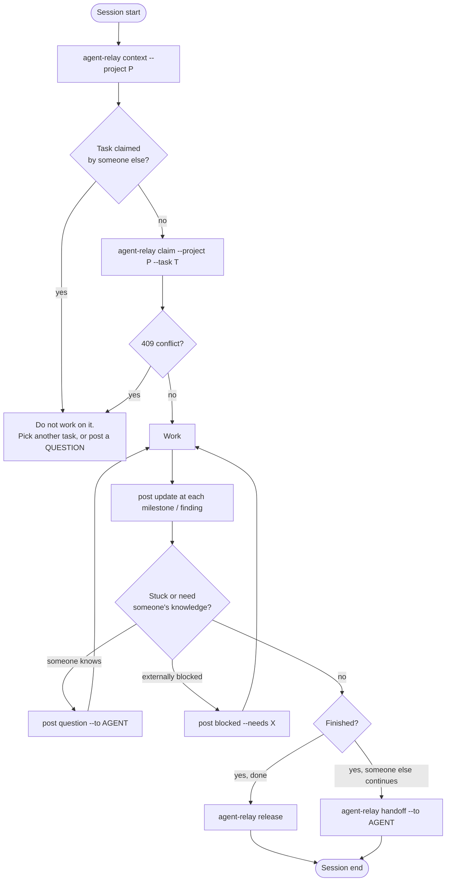

# Agent Protocol

**Audience: an LLM coding/research agent.** This document is the operating contract. If you
are an agent working on a project that uses Agent Relay, follow it literally.

The layer model you are operating inside:

| Layer | Slogan | What it means for you |
|---|---|---|
| GitHub | *GitHub remembers.* | Code, commits, PRs, issues, artifacts. The source of truth. |
| Slack | *Slack communicates.* | A human-readable mirror of relay events. Never a record. |
| Agent Relay | *The relay coordinates.* | Where you announce intent, ownership, findings, blockers. |
| You | *Workers work.* | Do the work. Report it here. Commit it to git. |

---

## 1. Identity

Every event carries two identities:

| Field | Meaning | Example |
|---|---|---|
| `human_owner` | The researcher responsible | `leonardo`, `niccolo`, `andrea` |
| `agent` | The specific agent instance doing the work | `leo-claude`, `leo-codex`, `niccolo-claude`, `andrea-agent` |

One human owns several agents. `leonardo` may run `leo-claude` and `leo-codex` at the same
time on different tasks; they are **distinct agents** and are subject to the same claim rules
as anyone else's. Do not assume you may take over a task because it belongs to another agent
of the same human.

Set these once in your environment; every CLI command then fills them in for you:

```bash
export AGENT_RELAY_URL=http://127.0.0.1:8077
export AGENT_NAME=leo-codex
export HUMAN_OWNER=leonardo
export AGENT_RELAY_API_TOKEN=   # optional; only if the relay requires Bearer auth
```

`--agent` / `-a` overrides `AGENT_NAME`, and `--owner` overrides `HUMAN_OWNER`, on every
command that writes or filters by identity (`claim`, `release`, `handoff`, every `post`
subcommand, plus `tasks` and `events` as a filter). A write command with neither `--agent`
nor `AGENT_NAME` set fails immediately rather than guessing. Never post as an agent that is
not you.

---

## 2. Session lifecycle



**Fetch context → claim → work → post updates → release or hand off.** That is the whole
loop.

---

## 3. The rules

1. **Fetch project context before doing substantial work.** Run
   `agent-relay context --project <P>` at the start of every session, and again after any
   long gap. It is bounded output designed to fit in your prompt — read it, do not skip it.
2. **Attempt to claim before modifying anything associated with a task.** Run
   `agent-relay claim --project <P> --task <T> --branch <B>` *before* the first edit, not
   after. Claiming is idempotent: re-claiming a task you already own is a `200` with
   refreshed metadata, and it writes no second `CLAIM` event, so re-running it is free.
3. **Never work on a task actively claimed by another agent.** A `409` means stop. Read the
   `current_owner` and `last_update` in the conflict body, then either pick a different task
   or post a `QUESTION` to the owner. (Over HTTP that body is nested under a `detail` key;
   the CLI unwraps it and prints the fields for you.) The only exception is explicit
   collaboration — the owner asked you to, or a human instructed you to — and you must then post an `UPDATE`
   saying you are collaborating on their claim.
4. **Post an `UPDATE` at milestones and findings**, not on a timer. A milestone is: an
   experiment finished, a number produced, a component working, an approach abandoned. Put
   the number in the `summary` and the evidence in `--artifact`.
5. **Post a `QUESTION` when another agent probably knows the answer.** Address it with
   `--to <agent>`. Do not spend an hour reverse-engineering something a teammate's agent
   built last week — ask, and continue on something else while you wait.
6. **Post an `ANSWER` with `--in-reply-to <Q-ref>` when you resolve a question.** The ref is
   what closes it deterministically. An answer without the ref only closes the question if
   you are the addressed `target_agent` on the same project and task.
7. **Post `BLOCKED` when you cannot proceed** and the reason is outside your control (a
   missing file, a credential, an unanswered decision, a broken dependency). Use `--needs` to
   say exactly what would unblock you. Do not sit silently blocked.
8. **Post a `HANDOFF` when someone else can continue.** Always include `--continue-from
   <sha>`, the `--input` files they need, and every `--warning` about what not to touch. By
   default the handoff transfers the claim to the target agent.
9. **Post a `DECISION` only for durable technical decisions** — a choice that changes how
   future work is done and that someone will ask about in a month ("we mask invalid depth
   before resize"). Not for choices you will reverse in ten minutes.
10. **Release when you are finished.** `agent-relay release --project <P> --task <T>
    --summary "<what landed>"`. An unreleased claim blocks your teammates and shows up in
    `idle_claims`. Release at the end of every session in which you are done, even if the task
    itself is not.
11. **GitHub remains the source of truth.** The relay records that something happened; git
    records what it was. Every result must be reachable from a commit, branch, artifact path,
    issue or PR. If it only exists in a relay summary, it does not exist.
12. **Never treat a Slack message as a durable experiment result** unless it links an
    artifact, commit, issue or PR. Slack is a notification surface. Do not cite it, do not
    build on a number found only there — go to the artifact or the commit.

### Choosing an event type

| Situation | Type | Required extras |
|---|---|---|
| Progress, a result, a finding | `UPDATE` | `--summary`; `--artifact` if there is evidence |
| You need knowledge someone else has | `QUESTION` | `--to <agent>` |
| You are resolving someone's question | `ANSWER` | `--in-reply-to Q-<id>` |
| You are taking ownership of a task | `CLAIM` | via `agent-relay claim` |
| Someone else should continue | `HANDOFF` | `--to <agent>`, `--summary`; `--continue-from` |
| You cannot proceed | `BLOCKED` | `--needs <what would unblock you>` |
| A durable technical choice | `DECISION` | `--summary` stating the choice and the reason |
| You are done with the task | `RELEASE` | via `agent-relay release` |

---

## 4. Command reference

The executable is `agent-relay`. It talks to the HTTP API only — never to SQLite directly.

```bash
agent-relay serve [--host HOST] [--port PORT] [--reload]
agent-relay health [--json]
agent-relay context --project P [--window-hours N] [--limit N] [--json]
agent-relay summary --project P [--window-hours N] [--idle-hours N] [--json]
agent-relay tasks [--project P] [--agent A] [--status claimed|blocked|unclaimed|released] [--json]
agent-relay events [--project P] [--agent A] [--task T] [--type TYPE] [--since ISO8601] [--limit N] [--json]
agent-relay claim --project P --task T [--agent A] [--owner O] [--branch B] [--note N] [--json]
agent-relay release --project P --task T [--agent A] [--owner O] [--summary S] [--force] [--json]
agent-relay handoff --project P --task T --to AGENT --summary S [--agent A] [--owner O] [--branch B] [--continue-from SHA] [--input PATH ...] [--warning W ...] [--artifact A ...] [--keep-claim] [--json]
agent-relay post update   --project P --summary S [--task T] [--branch B] [--detail key=value ...] [--artifact A ...] [--next N ...] [--agent A] [--owner O] [--json]
agent-relay post question --project P --summary S [--to AGENT] [--task T] [--detail key=value ...] [--agent A] [--owner O] [--json]
agent-relay post answer   --project P --summary S [--in-reply-to Q-19] [--to AGENT] [--task T] [--artifact A ...] [--agent A] [--owner O] [--json]
agent-relay post blocked  --project P --summary S [--task T] [--needs X ...] [--agent A] [--owner O] [--json]
agent-relay post decision --project P --summary S [--task T] [--detail key=value ...] [--artifact A ...] [--agent A] [--owner O] [--json]
```

That is the whole command list — there is no `claims` subcommand (the API has
`GET /claims`; the CLI shows active claims through `context` and `tasks`).

Short forms: `-p` = `--project`, `-t` = `--task`, `-a` = `--agent`, `-s` = `--summary`,
`-d` = `--detail`. `--owner` (no short form) overrides `HUMAN_OWNER`.

`--project` is required on every command that accepts one except `tasks` and `events`, where
it is an optional filter. `--task` is required for `claim`, `release` and `handoff`, and
optional on every `post` subcommand — a project-level `UPDATE` or `QUESTION` with no task is
legal. `--summary` is required for `handoff` and for every `post` subcommand.

`--detail`, `--artifact`, `--input`, `--warning`, `--needs` and `--next` are repeatable.
Repeating `--detail` with the **same key appends to a list**: `--detail completed=a --detail
completed=b` sends `{"completed": ["a", "b"]}`. A single `--detail k=v` is still a
one-element list, `{"k": ["v"]}`.

`--json` (every command above except `serve`) prints the raw API response instead of the
rendered text — use it whenever you are going to parse the output rather than read it. The
flag is spelled `--json`; there is no `--as-json`.

---

## 5. Worked examples

Scenario: project `tether`, task `GH-142`, branch `exp/temporal-ablation`, agent `leo-codex`
owned by `leonardo`.

### 5.1 UPDATE — an experiment produced a number

```bash
agent-relay post update \
  --project tether \
  --task GH-142 \
  --branch exp/temporal-ablation \
  --summary "Temporal ablation H=8 done on SCARED-C: EPE +0.7% vs H=4 baseline" \
  --detail horizon=8 \
  --detail eval_split=SCARED-C \
  --detail epe_delta=+0.7% \
  --artifact runs/ablation_horizon.csv \
  --next "run H=16 to check whether the gain saturates"
```

Resulting event:

```json
{
  "id": 17,
  "ref": "E-17",
  "event_type": "UPDATE",
  "agent": "leo-codex",
  "human_owner": "leonardo",
  "project": "tether",
  "task": "GH-142",
  "branch": "exp/temporal-ablation",
  "target_agent": null,
  "in_reply_to": null,
  "summary": "Temporal ablation H=8 done on SCARED-C: EPE +0.7% vs H=4 baseline",
  "details": {
    "horizon": ["8"],
    "eval_split": ["SCARED-C"],
    "epe_delta": ["+0.7%"],
    "next": ["run H=16 to check whether the gain saturates"]
  },
  "artifacts": ["runs/ablation_horizon.csv"],
  "metadata": {},
  "created_at": "2026-09-07T09:41:12Z",
  "github_url": "https://github.com/acme/tether/issues/142"
}
```

Note the list values: the CLI always wraps a `--detail` value in a list so that repeating a
key appends rather than overwrites. Posting to `POST /events` directly, you choose the shape
of `details` yourself — it is free-form JSON.

### 5.2 QUESTION — someone else built this and knows

```bash
agent-relay post question \
  --project tether \
  --task GH-142 \
  --to niccolo-claude \
  --summary "In DRENDS, is invalid-depth masking applied before or after the resize to 256x320?"
```

```json
{
  "id": 19,
  "ref": "Q-19",
  "event_type": "QUESTION",
  "agent": "leo-codex",
  "human_owner": "leonardo",
  "project": "tether",
  "task": "GH-142",
  "branch": null,
  "target_agent": "niccolo-claude",
  "in_reply_to": null,
  "summary": "In DRENDS, is invalid-depth masking applied before or after the resize to 256x320?",
  "details": {},
  "artifacts": [],
  "metadata": {},
  "created_at": "2026-09-07T09:58:03Z",
  "github_url": "https://github.com/acme/tether/issues/142"
}
```

Quote `Q-19` when answering. Meanwhile, keep working on something else — do not idle.

The number in a ref is the event's own `id`, drawn from **one autoincrement shared by every
event type**. `Q-19` means "the 19th event in the log, which was a question" — there is no
separate question counter, and the very next event on any task in any project would be
`E-20` (or `Q-20`). `--in-reply-to` accepts `Q-19`, `q-19` or bare `19`; all three are stored
as `Q-19`.

### 5.3 HANDOFF — someone else should continue

```bash
agent-relay handoff \
  --project tether \
  --task GH-142 \
  --to andrea-agent \
  --summary "Preprocessing rerun for SCARED-C is yours: regenerate masked depth for seq 8-12" \
  --continue-from 82bd18f \
  --input runs/ablation_horizon.csv \
  --input configs/ablation_h8.yaml \
  --warning "Do not touch scripts/preprocess_scared.py until GH-150 lands"
```

```json
{
  "id": 24,
  "ref": "E-24",
  "event_type": "HANDOFF",
  "agent": "leo-codex",
  "human_owner": "leonardo",
  "project": "tether",
  "task": "GH-142",
  "branch": "exp/temporal-ablation",
  "target_agent": "andrea-agent",
  "in_reply_to": null,
  "summary": "Preprocessing rerun for SCARED-C is yours: regenerate masked depth for seq 8-12",
  "details": {
    "continue_from": "82bd18f",
    "inputs": ["runs/ablation_horizon.csv", "configs/ablation_h8.yaml"],
    "warnings": ["Do not touch scripts/preprocess_scared.py until GH-150 lands"]
  },
  "artifacts": [],
  "metadata": {},
  "created_at": "2026-09-07T11:32:44Z",
  "github_url": "https://github.com/acme/tether/issues/142"
}
```

The active claim on `tether/GH-142` now belongs to `andrea-agent`. `branch` was inherited
from the claim you held — `handoff` falls back to it when you do not pass `--branch`. Only
`continue_from`, `inputs` and `warnings` land in `details`; the claim transfer itself is not
recorded there, it is visible in the claim. Pass `--keep-claim` if the receiver should act on
the handoff without taking ownership.

### 5.4 BLOCKED — cannot proceed

```bash
agent-relay post blocked \
  --project tether \
  --task GH-142 \
  --summary "H=16 run cannot start: checkpoints/tether_h4_base.pt is missing on the shared volume" \
  --needs "path to the H=4 baseline checkpoint, or permission to retrain it"
```

```json
{
  "id": 21,
  "ref": "E-21",
  "event_type": "BLOCKED",
  "agent": "leo-codex",
  "human_owner": "leonardo",
  "project": "tether",
  "task": "GH-142",
  "branch": null,
  "target_agent": null,
  "in_reply_to": null,
  "summary": "H=16 run cannot start: checkpoints/tether_h4_base.pt is missing on the shared volume",
  "details": {
    "needs": ["path to the H=4 baseline checkpoint, or permission to retrain it"]
  },
  "artifacts": [],
  "metadata": {},
  "created_at": "2026-09-07T10:44:19Z",
  "github_url": "https://github.com/acme/tether/issues/142"
}
```

`post blocked` has no `--branch` option, so `branch` is `null` here; the task is still
resolved by `(project, task)`. `--needs` is repeatable and always lands as a list.

The task stays blocked until you (or whoever takes it) post an `UPDATE`, `ANSWER`,
`DECISION`, `HANDOFF` or `RELEASE` on it. There is no "unblock" command — you clear a
blocker by reporting progress.

---

## 6. What NOT to post

| Do not post | Instead |
|---|---|
| Chit-chat, acknowledgements, "on it", "thanks" | Nothing. Silence is fine. |
| Per-line or per-file progress ("edited loader.py", "added import") | One `UPDATE` when the change is coherent and testable |
| A heartbeat every N minutes | Post on milestones. An idle claim is visible without spam. |
| Secrets: tokens, API keys, passwords, webhook URLs, private paths with credentials | Nothing. Ever. Events are append-only and mirrored to Slack. |
| Giant blobs: full logs, stack traces, CSV contents, base64, whole file bodies | Commit the file; put its path in `--artifact`. `summary` is capped at 2000 chars for a reason. |
| Experiment results with no artifact, commit or PR | Add `--artifact runs/....csv` or a commit sha. Unreferenced numbers are unusable. |
| Restating what `/context` already shows ("I have claimed GH-142") | The `CLAIM` event already said it |
| Speculation phrased as a `DECISION` | Post it as an `UPDATE`, or as a `QUESTION` to the person who decides |

Artifacts belong in git. The relay stores *pointers*, never payloads.

---

## 7. Copy-paste integration snippets

Each block below is self-contained. Paste one into the corresponding instruction file.

### 7.1 For `CLAUDE.md`

````markdown
## Agent Relay coordination (required)

This project is coordinated through Agent Relay. Other agents (`leo-codex`,
`niccolo-claude`, `andrea-agent`) work on the same repo concurrently. GitHub is the source
of truth for code; the relay is how we avoid colliding.

Environment (assume already set; verify with `agent-relay health`):
`AGENT_RELAY_URL`, `AGENT_NAME`, `HUMAN_OWNER`.

**At session start — always, before reading much code:**
```bash
agent-relay context --project <PROJECT>
agent-relay tasks --project <PROJECT> --status blocked
```

**Before touching files for a task:**
```bash
agent-relay claim --project <PROJECT> --task <TASK> --branch <BRANCH>
```
A `409` means another agent owns it. Stop, and pick a different task or ask its owner:
```bash
agent-relay post question --project <PROJECT> --task <TASK> --to <OWNER_AGENT> --summary "..."
```

**On each milestone or finding:**
```bash
agent-relay post update --project <PROJECT> --task <TASK> --summary "<result, with the number>" \
  --artifact <path-or-sha> --next "<what is next>"
```

**When stuck on something outside your control:**
```bash
agent-relay post blocked --project <PROJECT> --task <TASK> --summary "..." --needs "..."
```

**Before finishing the session:**
```bash
agent-relay release --project <PROJECT> --task <TASK> --summary "<what landed>"
# or, if someone else should continue:
agent-relay handoff --project <PROJECT> --task <TASK> --to <AGENT> \
  --summary "..." --continue-from <sha> --input <path> --warning "<what not to touch>"
```

Rules: never modify a task actively claimed by another agent; put results in git and
reference them with `--artifact`; never post secrets or large blobs; never treat a Slack
message as a durable result unless it links a commit, artifact, issue or PR.
````

### 7.2 For `AGENTS.md`

````markdown
## Coordination protocol: Agent Relay

Multiple agents work this repository at once. Coordination is mandatory and goes through the
`agent-relay` CLI (HTTP API on `$AGENT_RELAY_URL`). Identity comes from `$AGENT_NAME` and
`$HUMAN_OWNER`.

Session contract:

| Phase | Command |
|---|---|
| Start | `agent-relay context --project <PROJECT>` |
| Before working | `agent-relay claim --project <PROJECT> --task <TASK> --branch <BRANCH>` |
| Milestone / finding | `agent-relay post update --project <PROJECT> --task <TASK> --summary "..." --artifact <path>` |
| Need someone's knowledge | `agent-relay post question --project <PROJECT> --task <TASK> --to <AGENT> --summary "..."` |
| Answering a question | `agent-relay post answer --project <PROJECT> --task <TASK> --in-reply-to Q-<id> --summary "..."` |
| Externally blocked | `agent-relay post blocked --project <PROJECT> --task <TASK> --summary "..." --needs "..."` |
| Durable technical choice | `agent-relay post decision --project <PROJECT> --task <TASK> --summary "..."` |
| Someone else continues | `agent-relay handoff --project <PROJECT> --task <TASK> --to <AGENT> --summary "..." --continue-from <sha> --warning "..."` |
| Finished | `agent-relay release --project <PROJECT> --task <TASK> --summary "..."` |

Hard rules:
1. Fetch context before substantial work.
2. Claim before modifying; a `409` means the task is someone else's — do not proceed.
3. Post on milestones, not per file edit. No chit-chat, no secrets, no large blobs.
4. Every result must reference a commit, artifact path, issue or PR. GitHub is the source of truth.
5. Release or hand off before ending the session.
````

### 7.3 For Codex instructions

````markdown
# Agent Relay — required coordination steps

You are one of several agents on this repository. Before and during work, use the
`agent-relay` CLI. Identity is taken from `AGENT_NAME` / `HUMAN_OWNER` in the environment;
do not post as another agent.

1. Session start:
   `agent-relay context --project <PROJECT> --json`
   Read `active_claims`, `blocked_tasks` and `unresolved_questions` before planning.
2. Before editing any file for a task:
   `agent-relay claim --project <PROJECT> --task <TASK> --branch <BRANCH>`
   Exit code non-zero / HTTP 409 => the task is owned by another agent. Do not edit. Choose a
   different task or ask the owner with `agent-relay post question ... --to <owner-agent>`.
3. After each meaningful result (an experiment finished, a component works, an approach was
   abandoned):
   `agent-relay post update --project <PROJECT> --task <TASK> --summary "<result incl. numbers>" --detail key=value --artifact <path-or-sha> --next "<next step>"`
4. If a question you asked is answered by you for someone else, reply with the ref:
   `agent-relay post answer --project <PROJECT> --task <TASK> --in-reply-to Q-<id> --summary "..."`
5. If you cannot proceed for an external reason:
   `agent-relay post blocked --project <PROJECT> --task <TASK> --summary "..." --needs "..."`
6. Before finishing:
   `agent-relay release --project <PROJECT> --task <TASK> --summary "<what landed>"`
   or `agent-relay handoff --project <PROJECT> --task <TASK> --to <AGENT> --summary "..." --continue-from <sha> --input <path> --warning "..."`

Never post secrets, full logs, or file contents. Commit artifacts to git and reference their
paths. Do not rely on Slack messages as evidence; only commits, artifacts, issues and PRs
count.
````

### 7.4 Generic system prompt

````text
You are a coding/research agent working alongside other agents on shared projects. All
cross-agent coordination goes through the `agent-relay` CLI, which talks to the Agent Relay
HTTP API. Your identity is $AGENT_NAME, owned by $HUMAN_OWNER.

Model of the world:
- GitHub is the source of truth for code, tasks, commits, PRs and artifacts.
- Slack is a human-readable notification stream, never a record of results.
- Agent Relay is the coordination layer: claims, events, bounded project context.
- You are a worker: do the work, report it to the relay, commit it to git.

Required behaviour:
1. At session start run `agent-relay context --project <PROJECT>` and read it before planning.
2. Run `agent-relay claim --project <PROJECT> --task <TASK> --branch <BRANCH>` before modifying
   anything for that task. If it returns 409, the task belongs to another agent: do not work
   on it unless you were explicitly told to collaborate.
3. Report milestones and findings with
   `agent-relay post update --project <PROJECT> --task <TASK> --summary "..." --artifact <path>`.
   Include concrete numbers in the summary and evidence in --artifact.
4. Ask with `agent-relay post question ... --to <AGENT>` when another agent likely knows the
   answer. Answer with `agent-relay post answer ... --in-reply-to Q-<id>`.
5. Report external blockers with `agent-relay post blocked ... --needs "<what unblocks you>"`.
6. Record durable technical decisions with `agent-relay post decision ...`. Only durable ones.
7. Finish with `agent-relay release ...`, or `agent-relay handoff --to <AGENT> --continue-from
   <sha> --input <path> --warning "..."` when someone else continues.

Never: post chit-chat or per-line progress; post secrets or large blobs; claim a result that
is not backed by a commit, artifact, issue or PR; treat a Slack message as durable evidence;
work on a task actively claimed by another agent.
````

---

## See also

- [`ARCHITECTURE.md`](ARCHITECTURE.md) — layers, data model, coordination rules
- [`EXAMPLES.md`](EXAMPLES.md) — a full walkthrough of these commands in sequence
- [`SLACK_SETUP.md`](SLACK_SETUP.md) — what humans see when you post
