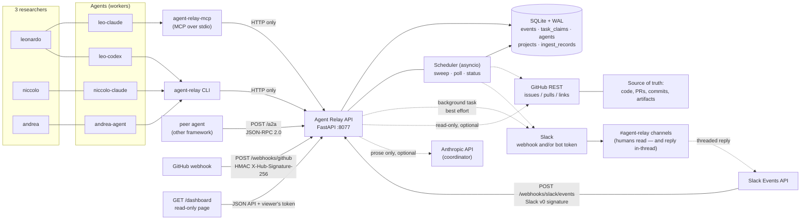
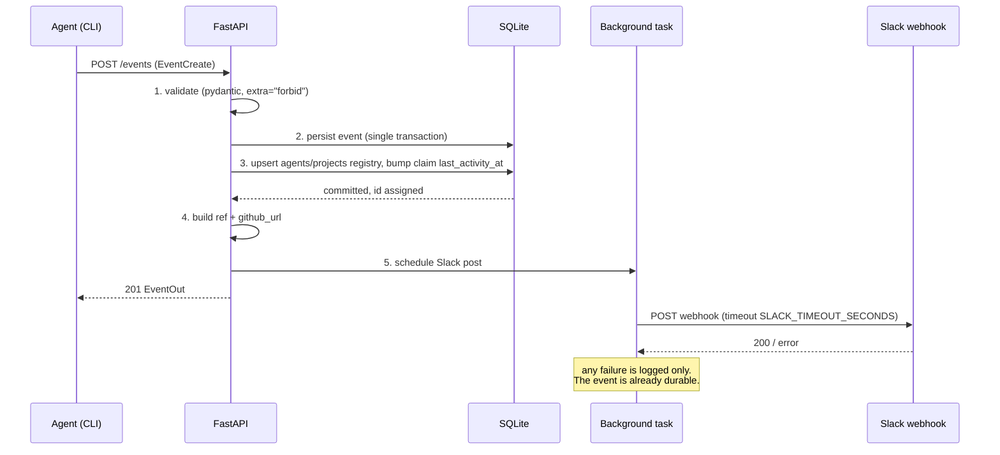
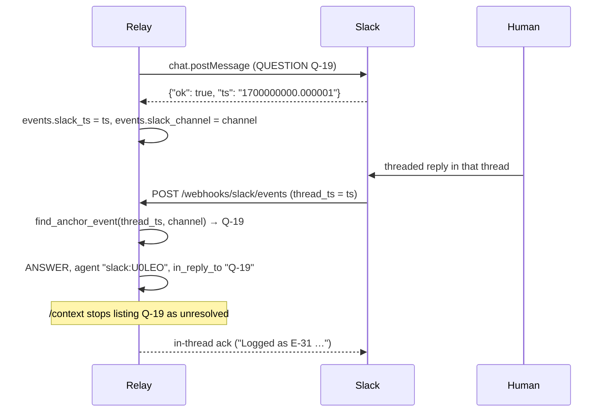
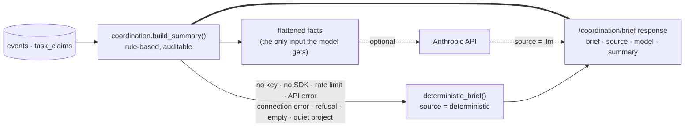

# Agent Relay — Architecture

Agent Relay is a coordination layer for three researchers (Leonardo, Niccolo, Andrea), each
running several coding/research agents (`leo-claude`, `leo-codex`, `niccolo-claude`,
`andrea-agent`, ...) across different machines and projects. It exists so that agents can
answer "who is doing what, right now, and what did they find?" without reading anybody's
terminal scrollback.

It is a tool for three people. It is not an enterprise platform, and the design is bounded
on purpose.

---

## 1. The four layers (plus one optional)

| Layer | Role | Slogan | Holds |
|---|---|---|---|
| **GitHub** | Source of truth | *GitHub remembers.* | Code, issues/tasks, PRs, commits, branches, experiment configs, durable artifacts |
| **Slack** | Human-readable event bus | *Slack communicates.* | A readable stream of what agents just did; nothing durable |
| **Agent Relay** | Structured coordination | *The relay coordinates.* | Events, task ownership, bounded project context |
| **Agents** | Workers | *Workers work.* | Code changes, experiments, analysis |
| **Coordinator LLM** | Optional prose layer | *The model narrates.* | Nothing. Reads the deterministic summary and writes a briefing; never a coordination decision |

Consequences of that split, which the rest of this document assumes:

- **Nothing in the relay is authoritative about code.** A relay event referencing a result
  without a commit, artifact path, issue or PR is a claim, not a record.
- **Slack is best effort.** Slack being down, misconfigured or absent changes nothing about
  correctness. Events are stored first; Slack is notified afterwards.
- **The relay stores coordination metadata, not content.** Summaries are capped at 2000
  characters; large outputs belong in git.
- **The relay never writes to GitHub.** The GitHub integration is read-only and optional; it
  builds links (`GH-142` → `.../issues/142`) and can read issue/PR metadata.
- **Inbound integrations authenticate themselves.** GitHub and Slack cannot present the relay's
  bearer token, so their webhook routes verify an HMAC over the raw body instead (§8). Anything
  they write is stamped with a `source` and an actor name no relay agent can own
  (`github:leonardo`, `slack:U0LEO`).
- **The LLM is never load-bearing.** `/coordination/brief` computes the deterministic summary
  first and returns it alongside the prose, whatever happens to the model (§7). Everything
  else in the relay — claims, context, summaries, stale detection, ingestion — is rule-based.

---

## 2. System diagram



The CLI is the client agents are expected to use, and it talks **exclusively to the HTTP
API**. It never opens the SQLite file. That single rule is what makes it safe for four agents
on three machines to write concurrently: the database has exactly one writer process.

V2 adds three more ways in, and every one of them keeps that rule. The MCP server
(`agent-relay-mcp`) is a second *client*, not a second backend — it wraps the same HTTP calls
the CLI makes. The A2A endpoint dispatches to the same service functions the REST routes use,
so a peer agent cannot reach a code path a normal agent could not. The webhook routes write
through the same `create_event` as everybody else, then stamp provenance on the result. There
is still exactly one writer process and exactly one write path.

---

## 3. Data model

Five tables (`src/agent_relay/db/models.py`). `events` is the real one; `task_claims` is
derived state that must be transactional; `agents` and `projects` are conveniences rebuilt
from events on every write, so losing them loses nothing; `ingest_records` (V2) is the
idempotency ledger for inbound webhooks and pollers.

### `events` — append-only. Never updated, never deleted.

| Column | Type | Notes |
|---|---|---|
| `id` | int PK | |
| `event_type` | str(16), indexed | `UPDATE`/`QUESTION`/`ANSWER`/`CLAIM`/`HANDOFF`/`BLOCKED`/`DECISION`/`RELEASE` |
| `agent` | str(128), indexed | Author, e.g. `leo-codex` |
| `human_owner` | str(128), indexed, nullable | e.g. `leonardo` |
| `project` | str(128), indexed | e.g. `tether` |
| `task` | str(128), indexed, nullable | e.g. `GH-142` |
| `branch` | str(255), nullable | e.g. `exp/temporal-ablation` |
| `target_agent` | str(128), indexed, nullable | Addressee of a QUESTION/ANSWER/HANDOFF |
| `in_reply_to` | str(32), indexed, nullable | For ANSWER: the question ref, e.g. `Q-19` |
| `summary` | str(2000) | One-line human-readable statement |
| `details_json` | JSON as TEXT, nullable | Free-form structured body |
| `artifacts_json` | JSON as TEXT, nullable | Paths, run ids, commit shas, URLs |
| `metadata_json` | JSON as TEXT, nullable | Anything else |
| `created_at` | UTC datetime, indexed | Defaults to server time |
| `source` | str(16), indexed, default `agent` | **V2.** Provenance: `agent`, `github`, `slack`. Set by the relay *after* creation, never from the request payload |
| `slack_ts` | str(32), indexed, nullable | **V2.** Slack message `ts` of the posted copy — the anchor a threaded human reply is matched against |
| `slack_channel` | str(32), nullable | **V2.** Channel that copy lives in; a `ts` is only unique per channel |

Indexes: `ix_events_project_created (project, created_at)`, `ix_events_project_task (project, task)`.

`ref` is a computed property, not a column: `Q-<id>` for QUESTION, `E-<id>` for everything
else, where `<id>` is the `events.id` primary key. There is **one** autoincrement shared by
every event type — `Q-19` is the 19th event overall that happened to be a question, not the
19th question — which is why a ref is unique across the whole log and can be quoted without
qualification. `in_reply_to` accepts `Q-19`, `q-19` or bare `19` and is normalised to `Q-19`
on write. JSON columns are stored as TEXT rather than a native JSON type so the database stays
readable with plain `sqlite3` from a terminal — transparency is the point of the tool.

### `task_claims` — who currently owns which task

| Column | Type | Notes |
|---|---|---|
| `id` | int PK | |
| `project` | str(128), indexed | |
| `task` | str(128), indexed | |
| `agent` | str(128), indexed | Current owner |
| `human_owner` | str(128), nullable | |
| `branch` | str(255), nullable | |
| `note` | str(2000), nullable | Free note supplied at claim time |
| `active` | bool, indexed | |
| `claimed_at` | UTC datetime | |
| `released_at` | UTC datetime, nullable | |
| `last_activity_at` | UTC datetime | Bumped by events on the task |

`uq_active_claim_per_task` is a **partial unique index** on `(project, task) WHERE active`.
The rule is enforced twice on purpose: `services/claims.py` checks for an existing active
claim first, so the common case gets a good error message, and the index is the backstop, so
a race between two agents on two machines still cannot produce duplicated ownership — the
loser gets an integrity error, which is caught, re-read and reported as the same
`409 ClaimConflict` naming the winner.

### `projects` — registry

| Column | Type |
|---|---|
| `name` | str(128) PK |
| `first_seen_at` | UTC datetime |
| `last_seen_at` | UTC datetime |

### `agents` — registry

| Column | Type | Notes |
|---|---|---|
| `name` | str(128) PK | e.g. `leo-codex` |
| `human_owner` | str(128), nullable | e.g. `leonardo` |
| `last_project` | FK → `projects.name`, `ON DELETE SET NULL`, nullable | |
| `first_seen_at` | UTC datetime | |
| `last_seen_at` | UTC datetime, indexed | Drives "active agents" in `/context`. Bumped by *any* event the agent posts |
| `last_heartbeat_at` | UTC datetime, indexed, nullable | **V2.** Explicit liveness signal, written only by `POST /heartbeat` |
| `host` | str(255), nullable | **V2.** Reported by the heartbeat |
| `pid` | int, nullable | **V2.** Reported by the heartbeat |
| `version` | str(64), nullable | **V2.** Agent build, reported by the heartbeat |
| `status_note` | str(500), nullable | **V2.** Free-text "what I am doing right now" |
| `current_task` | str(128), nullable | **V2.** Task named by the most recent heartbeat |

`last_seen_at` and `last_heartbeat_at` answer different questions and must not be conflated.
Any event moves `last_seen_at` ("when did this agent last *say* something"); only a heartbeat
moves `last_heartbeat_at` ("is this agent still alive"). An agent can be alive and silent for
an hour while a training run finishes, and it can be dead thirty seconds after its last
`UPDATE` while still holding a claim nobody else may take. The second case is the entire
reason `services/presence.py` exists. A heartbeat only writes the fields it actually carried,
so a bare liveness ping never blanks the `host`/`pid`/`status_note` a richer ping recorded a
minute earlier.

### `ingest_records` — idempotency ledger (V2)

| Column | Type | Notes |
|---|---|---|
| `id` | int PK | |
| `source` | str(16), indexed | `github` or `slack` |
| `external_id` | str(255) | Delivery id, Slack event id, or a synthesised natural key |
| `event_id` | int, nullable | The event this delivery produced, when it produced one |
| `received_at` | UTC datetime | |

`uq_ingest_source_external` is a unique index on `(source, external_id)`. The ledger row is
written in the **same transaction** as the event it produced, which is what makes it
authoritative rather than advisory: two concurrent retries of one delivery race into an
`IntegrityError`, which is caught and treated as "already ingested". Without it, GitHub's
retry policy would turn one push into three identical `UPDATE` events. Key shapes are in §5.

### Schema migration policy (V2)

`db/migrate.py` runs on every boot, before the app serves anything, and does exactly two
kinds of change:

1. `Base.metadata.create_all()` — creates tables that do not exist yet (`ingest_records` on a
   V1 database). It never touches an existing table.
2. `ALTER TABLE ... ADD COLUMN` for every mapped column missing from an existing table, with a
   literal scalar default inlined where the model has one. `events.source` is then backfilled
   to `'agent'`, because rows written before the column existed came from agents.

**Nothing is ever dropped, renamed or retyped**, and that narrowness is the whole policy: it
is enforced by being the only thing implemented. A `NOT NULL` column with no default cannot be
added to a table that already has rows, so that case is logged as an error and skipped rather
than corrupting a live database. The function returns the list of changes it applied, so boot
logs them and tests assert on them.

The moment a change needs more than this — a rename, a type change, a data migration, a
downgrade path — that is the signal to adopt Alembic, not to extend `migrate.py`. Until then,
a V1 database upgrades in place with no manual step and no data loss.

### Datetime handling

`UTCDateTime` (`db/types.py`) stores naive UTC and returns timezone-aware UTC. SQLite has no
native timezone support, and a plain `DateTime(timezone=True)` hands back naive datetimes
that then explode when compared with `datetime.now(dt.UTC)`. Everything crossing the wire is
ISO 8601 UTC.

---

## 4. Request lifecycle: `POST /events`



Step by step:

1. **Validate.** `EventCreate` uses `extra="forbid"`: an unknown field is a `422`, not a
   silently dropped value. `HANDOFF` without `target_agent` is rejected by a model validator.
   `timestamp` defaults to server time (UTC) when omitted.
2. **Persist.** One insert into `events`. Once this commits, the event exists — everything
   after this point is decoration.
3. **Registry upsert.** `agents` and `projects` rows are created/updated (`last_seen_at`,
   `human_owner`, `last_project`), and the active `task_claims` row for `(project, task)`, if
   any, has `last_activity_at` bumped. This is what makes `idle_claims` computable later.
4. **Enrich.** `ref` (`Q-<id>` / `E-<id>`) and `github_url` (from `GITHUB_TASK_PREFIX`, pure
   string work, no network) are attached to the response.
5. **Slack, in a background task, after the response.** The Slack post **cannot fail the
   request**: it runs after the response is returned, it is filtered by
   `SLACK_EVENT_TYPES`, it is bounded by `SLACK_TIMEOUT_SECONDS`, and any exception is
   logged and swallowed. No event is ever lost because Slack was unreachable, and no agent is
   ever blocked on Slack latency. With `SLACK_WEBHOOK_URL` unset, step 5 does not happen at
   all and everything else is unchanged.

`POST /claim`, `POST /release` and `POST /handoff` follow the same shape: mutate
`task_claims` and write the corresponding `CLAIM`/`RELEASE`/`HANDOFF` event in the same
transaction, then notify Slack in the background. They answer `200`, not `201` — they
return the resulting claim (or, for a handoff, the `HANDOFF` event), not a newly created
resource at a new address. The one case that writes nothing is an idempotent re-claim by the
current owner: no `CLAIM` event, and therefore no Slack post.

---

## 5. Inbound paths: webhooks, polling and the scheduler

V1 had one way in: an agent calling the HTTP API. V2 adds three more. All are optional, all
are off until configured, and none of them can create an event that looks like an agent's.

| Path | Enabled by | Authenticated by | Writes |
|---|---|---|---|
| `POST /webhooks/github` | `GITHUB_WEBHOOK_SECRET` | HMAC-SHA256 over the raw body (`X-Hub-Signature-256`) | Events with `source="github"`, agent `github:<login>` |
| `POST /webhooks/slack/events` | `SLACK_BOT_TOKEN` **and** `SLACK_SIGNING_SECRET` | Slack v0 signature + 5-minute timestamp window | Events with `source="slack"`, agent `slack:<user id>` |
| GitHub polling | `GITHUB_POLL_INTERVAL_SECONDS > 0` with `GITHUB_OWNER`/`GITHUB_REPO` | n/a — the relay is the caller | Same shape as the webhook path |
| Scheduler | per job, below | n/a — in-process | Sweep releases (only if configured), poll events |

### GitHub → events

`services/github_ingest.py` maps a delivery onto at most one event, and returns `None`
liberally: the relay is a coordination log, not a mirror of the repo's activity feed.

| Webhook event | Actions kept | Becomes | Task |
|---|---|---|---|
| `issues` | `opened`, `closed`, `reopened` | `UPDATE` | `<prefix><issue number>` |
| `pull_request` | `opened`, `closed`, `reopened`, `ready_for_review` | `UPDATE` — **`DECISION` when the PR was merged** | A `GH-142` found in the title or head branch, else `<prefix><PR number>` |
| `push` | branch pushes with ≥1 commit | `UPDATE` | A `GH-142` found in the branch name or a commit message, else none |
| `issue_comment` | `created` | `UPDATE` | `<prefix><issue number>` |
| `ping` | — | nothing; answered `{"status": "pong"}` | — |
| anything else | — | nothing; answered `{"status": "ignored"}` | — |

A merged PR is the one GitHub event that becomes a `DECISION`: merging is the moment a change
becomes the repository's answer, and everything else about a PR is progress. Tags, branch
deletions, zero-commit pushes and comment edits are dropped — an edit is not a new statement,
and the log is append-only. `GITHUB_INGEST_PROJECT` decides which relay project the activity
is filed under, falling back to `GITHUB_REPO`; with neither, the delivery is dropped.

The poller is the fallback for a relay with no publicly reachable URL. It announces open PRs
it has not seen, keyed `pr:<number>:<open|draft>`, and never raises: a poller that can take
the relay down is worse than no poller.

### Slack → events

The round trip needs a **bot token**, because only `chat.postMessage` returns the message
`ts`. Stored on the event as `slack_ts`, that string is the whole trick: a human's threaded
reply carries the same value as `thread_ts`, so the relay can find the exact event being
replied to.



**Where the anchor comes from.** An event only acquires an anchor if it is posted with the
*bot token*, because only `chat.postMessage` returns a `ts`. `POST /events` dispatches through
`slack_bot.announce`, which prefers the bot whenever `SLACK_BOT_TOKEN` is set and writes the
returned `(ts, channel)` back onto the event row in its own session — the request's session is
long gone by then, and a failure there must not be able to undo an event that is already
committed. With only `SLACK_WEBHOOK_URL` set there is no `ts` and therefore no anchor: the
relay can talk but not listen.

A reply whose anchor is a `QUESTION` becomes an `ANSWER` with `in_reply_to` set to the
question's ref and `target_agent` set to whoever asked — which is exactly the condition that
closes the question deterministically (§6). A reply to any other event becomes an `UPDATE` on
the same project and task: a human note on that piece of work. Top-level messages, bot
messages (including the relay's own ack), edits, deletions and channel joins are all ignored,
and so is a reply in a thread the relay did not start. Mention markup and link markup are
stripped so the summary reads as prose.

Per-project routing comes from `SLACK_CHANNEL_MAP` (`tether=C012AB,drends=C034CD`) with
`SLACK_DEFAULT_CHANNEL` as the fallback.

### Idempotency

Both senders retry, on their own schedule, whenever they do not get a fast `200`. Every
ingested delivery writes an `ingest_records` row in the same transaction as its event:

| Source | `external_id` |
|---|---|
| GitHub webhook | `X-GitHub-Delivery`, or `<event>:<sha256 of the body>[:32]` when that header is missing |
| GitHub poller | `pr:<number>:<open\|draft>` |
| Slack events | Slack's `event_id` |

A replay finds its ledger row, creates nothing, and is answered `200 {"status": "duplicate"}`.

### Webhook routes never 500

A `500` on an unmappable payload buys the same broken delivery three more times, forever.
Anything the relay does not understand — a non-JSON body, an unexpected shape, an exception
during mapping — is logged and answered `200 {"status": "ignored"}` after a rollback. The only
non-`200` answers on these routes are `503` (the feature is not configured on this relay) and
`401` (missing or invalid signature).

### The scheduler

One `asyncio` task, started in the app lifespan and stopped with it (`services/scheduler.py`).
It wakes every 30 seconds and runs whatever is due. Each job is isolated: one raising is
logged and the loop and the other jobs continue.

| Job | Enabled by | Default | Does |
|---|---|---|---|
| `sweep` | `AGENT_RELAY_SWEEPER_INTERVAL_SECONDS > 0` | **on**, every 300s | `presence.sweep()` — reports every stale claim; releases only those older than `AGENT_RELAY_CLAIM_EXPIRY_HOURS`, which is `0` (never) by default |
| `poll` | `GITHUB_POLL_INTERVAL_SECONDS > 0` + GitHub configured | off | One `github_ingest.poll_once()` tick |
| `status` | `AGENT_RELAY_STATUS_INTERVAL_MINUTES > 0` **and** `AGENT_RELAY_STATUS_PROJECTS` non-empty | off | One brief per listed project, posted to Slack — bot token if set, else the incoming webhook, else logged |

Not Celery, not a cron container, not APScheduler: the relay is one process for three people,
and a scheduler needing its own infrastructure would cost more than the problem it solves.
Every job is written to be safe to run twice. The status post goes to Slack directly rather
than through the event log — a roll-up is a *view* of events, not an event, and writing it
back would make the next roll-up summarise itself.

---

## 6. Deterministic coordination rules

`/coordination/summary` and the derived fields of `/context` and `/tasks` are **rule-based**.
No LLM is involved. The same database state always produces the same summary, and any human
can verify a result by reading the event list.

### Blocked

> A task is **blocked** when its most recent `BLOCKED` event is newer than *every*
> `UPDATE`, `ANSWER`, `DECISION`, `HANDOFF` and `RELEASE` event on the same `(project, task)`
> — equivalently, when nothing unblocking has been posted since the last `BLOCKED`.

"Newer" is by event id, not timestamp, so a backdated `timestamp` cannot reorder the rule.

The unblocking set is `UNBLOCKING_EVENTS` in `models/enums.py`. Note what is *not* in it:
a `QUESTION` does not unblock (asking about your blocker is not resolving it), and a `CLAIM`
does not unblock (taking the task over does not fix it). There is no "unblock" verb and no
mutable status field — you clear a blocker by reporting progress. `blocked_reason` on
`TaskOut` is the summary of that latest `BLOCKED` event, and `blocked_by` is the agent that
posted it. `blocked_by` is deliberately separate from `owner`: whoever reported the block is
not necessarily whoever holds the claim, and a task can be blocked while unclaimed — in which
case `owner` is `null` and `blocked_by` is still set.

### Unresolved question

> A `QUESTION` is **unresolved** when **(a)** no `ANSWER` event carries `in_reply_to` equal
> to its ref (`Q-19`), **and (b)** no `ANSWER` from its `target_agent` on the same
> `(project, task)` was created after it.

Clause (a) is the exact form and is what agents should aim for. Clause (b) is the pragmatic
fallback: a human or agent who answers in the right thread without quoting the ref still
closes the question. `OpenQuestion.age_hours` is computed at request time; a question with
no `target_agent` is only closable by clause (a).

### Possible conflict

Only **work** counts. `WORK_EVENTS` in `models/enums.py` is `{UPDATE, DECISION, BLOCKED}`:
those are the event types that mean *someone is doing the task*. `QUESTION`/`ANSWER` (talking
about it) and `CLAIM`/`HANDOFF`/`RELEASE` (passing it along) never signal duplicated effort —
two agents discussing or transferring a task is coordination working correctly.

> Restricted to work events inside the window, and — when the task is currently claimed — to
> work at or after that claim's `claimed_at`, a task has a **possible conflict** when either
> **(a)** an agent other than the current claim holder did work on it, or
> **(b)** nobody holds the claim and more than one distinct agent did work on it.

The `claimed_at` cut-off is what keeps a handoff clean: work the previous owner did before
the receiver's claim started is history, not a conflict, so a handoff never leaves a phantom
conflict pointing at its predecessor.

`PossibleConflict` carries `task`, the `agents` involved, a `reason` string, and `claimed_by`
(`null` when nothing is claimed). The two `reason` templates, verbatim from
`services/coordination.py`, are:

```text
<others> did work on <task> while it is claimed by <owner>
<n> agents did work on <task> in the last <window_hours>h with nobody holding the claim
```

It is deliberately named *possible*: genuine sanctioned collaboration trips rule (b) too. The
relay reports, it does not adjudicate.

### Idle claims and suggested actions

`idle_claims` are active claims whose `last_activity_at` is older than `idle_hours` (query
parameter, default `24`). `suggested_actions` are literal strings templated from the rows
above — not model output. There is one template per situation, emitted in this order
(questions, conflicts, blocks, idle claims; at most five of each):

```text
resolve <ref> from <from_agent> to <to_agent|the team> (open <age>h)
avoid duplicated work on <task>: <conflict reason>
unblock <task> for <agent>: <reason> (<github issue url, when GitHub is configured>)
check on <agent>: <task> claimed but idle for more than <idle_hours>h — release it if abandoned
```

---

## 7. The LLM's place in the design

Exactly one module calls a model: `services/coordinator.py`, reached by
`GET /coordination/brief` and by the scheduler's `status` job. It sits **on top of** the
deterministic summary and can never take its place.



What that ordering buys, all deliberate:

- The response **always** carries the full deterministic `summary`, plus `source` (`"llm"` or
  `"deterministic"`) and `model` (`null` unless `source` is `"llm"`). Prose can always be
  checked against the facts it was generated from.
- The model never sees the database — only the already-computed summary — so it has nothing to
  hallucinate *from*. The system prompt forbids inventing a task, agent, finding, number or
  blocker, and caps the answer at roughly 200 words.
- Every failure degrades instead of erroring: no `ANTHROPIC_API_KEY`, the `anthropic` extra not
  installed, a rate limit, an API status error, a connection error, a refusal, or an empty
  response all fall back to the rule-based briefing. A model outage costs a paragraph, never a
  coordination decision.
- A project with nothing happening never reaches the model at all (`is_quiet()`), so an idle
  relay costs nothing.
- Nothing else consults a model, ever: claims, `/context`, `/coordination/summary`,
  `/coordination/overview`, presence, stale detection, A2A intent parsing and both ingestion
  paths are pure rules.

`COORDINATOR_EFFORT` (default `low`) is validated against `low|medium|high|xhigh|max` before
the call, so a typo in `.env` warns and falls back instead of being rejected by the API.

---

## 8. Trust boundaries

Two different mechanisms guard two different populations. They are not interchangeable.

| Boundary | Guarded by | Applies to | Failure |
|---|---|---|---|
| Team → relay | `AGENT_RELAY_API_TOKEN`, an optional shared bearer token | Every route except those listed below | `401` |
| GitHub → relay | HMAC-SHA256 over the raw body (`X-Hub-Signature-256`) | `POST /webhooks/github` | `401`; `503` when unconfigured |
| Slack → relay | Slack v0 signature over `v0:<timestamp>:<raw body>`, plus a 5-minute replay window | `POST /webhooks/slack/events` | `401`; `503` when unconfigured |

**Why the webhook routes deliberately do not require the bearer token.** GitHub and Slack
cannot send one. A webhook sender submits the headers its own settings page allows, so
requiring `Authorization: Bearer <team token>` would mean either no webhooks at all, or pasting
the team's shared secret into a third party's configuration — where it would then also
authorise `POST /events`, `POST /claim`, `POST /release` and everything else. A per-integration
signature is strictly better: it is scoped to one sender, it is rotatable without touching a
single agent, and it proves the body was not modified in transit.

Three rules make those signatures worth something:

1. **Verification is mandatory whenever the feature is on.** There is no "skip validation"
   switch; without a secret the route answers `503` rather than accepting anything.
2. **It runs before any parsing.** The signature covers the bytes on the wire — a re-serialised
   body has different whitespace and key order and will not match — so the raw body is read
   first and JSON is decoded only afterwards.
3. **Comparison is constant-time**, and a malformed header is a rejection rather than a
   best-effort parse. Slack's timestamp window matters too: a signature stays valid forever, so
   without the 5-minute check a captured request could be replayed at any point.

Deliberately open routes:

| Route | Why |
|---|---|
| `GET /health` | A liveness probe that needs a credential is not a liveness probe |
| `GET /.well-known/agent.json` | Discovery precedes credentials, and the card holds only a name, a URL and the skill list |
| `GET /dashboard` | The page contains markup, not data. A `401` on the page itself is a blank screen with no way to recover; its `fetch` calls hit the token-protected API and *do* `401`. The page asks the viewer for the token and keeps it in `localStorage` under `agent_relay_token`, so the secret ends up in the browser of someone who already knew it. Templating the server's token into the HTML would hand the team secret to exactly the population the token exists to exclude. `GET /dashboard/projects` is an API call and is token-protected like everything else |
| `POST /webhooks/github`, `POST /webhooks/slack/events` | Signature-authenticated instead — see above |

**What is not protected at any level.** There is no per-agent identity: `agent` is a string in
the request body, so anyone who can reach the API can post as any name, `force`-release
anyone's claim, and read everything. The shared token is a speed bump for a trusted LAN, not an
authentication system, and the relay is not built to be exposed to the public internet — only
its two webhook routes are, ideally through a reverse proxy that publishes nothing else (see
[`OPERATIONS.md`](OPERATIONS.md)).

Provenance runs the other way and *is* enforced. Ingested actors are namespaced so they cannot
collide with a real agent name (`github:leonardo`, `slack:U0LEO`, `a2a-client`), and
`events.source` is set by the relay after the event is created — never from the payload — so a
caller cannot claim to be GitHub.

---

## 9. What is deliberately absent

| Not used | Why |
|---|---|
| **LLM in the coordination rules** | Coordination must be reproducible and auditable. A rule-based summary is debuggable at 2am; a model's is not. V2 added an optional model *on top* (`/coordination/brief`, §7) that turns the summary into prose — it never computes the summary, and the endpoint returns the same answer with the model switched off. |
| **Kafka / RabbitMQ / any broker** | The workload is a few hundred events per day from four agents. A table with an index on `(project, created_at)` is the correct queue here. |
| **Redis** | Nothing to cache. Queries hit an indexed SQLite table and return in microseconds. |
| **Vector DB / embeddings** | `/context` is bounded, structured and filtered by exact fields. Semantic retrieval over a few hundred rows solves a problem nobody has. |
| **Microservices** | One FastAPI process, one SQLite file. Deployment is `agent-relay serve`. |
| **Postgres (by default)** | SQLite with WAL, `foreign_keys=ON` and `busy_timeout=5000` handles single-digit concurrent writers. `AGENT_RELAY_DB_URL` accepts a Postgres URL if that ever stops being true. |
| **User accounts / RBAC** | Three trusted people. `AGENT_RELAY_API_TOKEN` gives one optional shared Bearer token; that is the whole security model (§8). |
| **A migration framework** | `db/migrate.py` adds columns and tables on boot and does nothing else. Alembic is the answer the first time a change needs more than that, not a dependency to carry until then. |
| **Mutable event records** | Events are append-only. Correcting something means posting a new event, which preserves the record of the correction. |

The design target is that a new contributor can read the source in one sitting.

---

## 10. HTTP surface

| Method | Path | Returns |
|---|---|---|
| GET | `/health` | `200` `{status, version, time, database, integrations}` — no auth required |
| POST | `/events` | `201` `EventOut` |
| GET | `/events?project=&agent=&human_owner=&task=&event_type=&target_agent=&since=&limit=` | `list[EventOut]`, newest first, `limit` default 50 / max 500 |
| GET | `/events/{event_id}` | `EventOut`, `404` if there is no such event |
| GET | `/context?project=X&window_hours=&limit=` | `ProjectContext` (`limit` max 50) |
| POST | `/claim` | `200` `ClaimOut`, or `409` when another agent holds it |
| POST | `/release` | `200` `ClaimOut`, `409` for a non-owner without `force=true`, `404` when the task has no active claim |
| POST | `/handoff` | `200` `EventOut`, or `409` when the claim belongs to a third agent |
| GET | `/claims?project=&agent=` | `list[ClaimOut]` — every currently active claim |
| GET | `/tasks?project=&agent=&status=&limit=` | `list[TaskOut]`, `status` one of `claimed\|blocked\|unclaimed\|released`, `limit` default 200 / max 500 |
| GET | `/coordination/summary?project=X&window_hours=&idle_hours=` | `CoordinationSummary` (`idle_hours` default 24) |
| GET | `/github/issues/{number}` | Issue metadata, `404` if unreadable, `503` when GitHub is not configured |
| GET | `/github/pulls?limit=` | Open PRs (`limit` default 20 / max 100), `503` when GitHub is not configured |

Added in V2:

| Method | Path | Returns |
|---|---|---|
| POST | `/heartbeat` | `200` `AgentPresence` for the agent that pinged |
| GET | `/agents?project=&status=` | `list[AgentPresence]`, most actionable first; `status` one of `online\|idle\|offline\|unknown` |
| GET | `/claims/stale?project=` | `list[StaleClaim]`, longest-idle first |
| POST | `/claims/sweep` | `200` `SweepReport` — `{swept_at, auto_release_enabled, claim_stale_hours, claim_expiry_hours, released, still_stale, errors}` |
| GET | `/coordination/brief?project=X&window_hours=` | `200` `{project, generated_at, window_hours, brief, source, model, summary}` |
| GET | `/coordination/overview?window_hours=&idle_hours=` | `200` `RelayOverview` — per-project counts, `overloaded_agents`, `busiest_projects`, `totals`, `suggested_actions` |
| GET | `/experiments?project=&limit=` | `list[ExperimentRun]`, newest first (`limit` default 50 / max 200) |
| GET | `/dashboard` | `200` HTML, `404` when `AGENT_RELAY_DASHBOARD=false`. **No token** |
| GET | `/dashboard/projects` | `list[str]` — every known project name |
| POST | `/webhooks/github` | `200` `{status: created\|duplicate\|ignored\|pong, event}`; `401` bad signature; `503` unconfigured. **No token** |
| POST | `/webhooks/slack/events` | `200` `{status, event, challenge}`; `401` bad signature; `503` unconfigured. **No token** |
| GET | `/.well-known/agent.json` | A2A Agent Card. **No token** |
| POST | `/a2a` | JSON-RPC 2.0. Always `200`, carrying either `result` or a JSON-RPC `error` object |

V2 semantics worth stating once:

- **`/heartbeat` is not an event.** It writes only the `agents` row (and refreshes the claim's
  `last_activity_at` when it names a `project` *and* a `task`). It never appears in `/events`,
  never reaches Slack, and never shows up in `/context`. Omitted fields mean "unchanged".
- **Presence thresholds are arithmetic, not heuristics.** `online` ≤
  `AGENT_RELAY_HEARTBEAT_ONLINE_SECONDS` (300) since the last heartbeat, `idle` ≤
  `AGENT_RELAY_HEARTBEAT_IDLE_SECONDS` (1800), `offline` beyond that, and `unknown` when the
  agent has never heartbeated. `unknown` is deliberately not `offline`: an agent that has never
  sent one is probably an older build, and calling it offline would licence auto-releasing
  every claim it holds. `StaleClaim.owner_offline` is true only for a heartbeating agent that
  stopped — the genuinely dangerous case.
- **Reporting and releasing are separate settings.** `AGENT_RELAY_CLAIM_STALE_HOURS` (24)
  decides what a human is *told* about; `AGENT_RELAY_CLAIM_EXPIRY_HOURS` (`0` = never) decides
  what the relay is allowed to *take away*. `POST /claims/sweep` with the default configuration
  releases nothing and returns everything under `still_stale`. An auto-release is a forced
  `RELEASE` posted by the agent name `relay`, carrying
  `metadata: {"auto_released": true, "previous_owner": ..., "idle_hours": ...}`.
- **`/coordination/overview` is `/coordination/summary` run per project** (at most 50), so the
  blocked/conflict/question rules live in one place. The one genuinely cross-project signal is
  `overloaded_agents`: an agent holding claims in more than one project at once, which no
  single project's summary can see.
- **`/experiments` never contacts a tracker.** It scans event `artifacts` and `metadata` for
  references and returns `{tracker, run_id, url, raw}`, de-duplicated on `(tracker, run_id)`.
  `url` is `null` when the tracker is not configured — reporting "leo-codex mentioned run
  `abc123`" without a link beats dropping the reference.
- **`/a2a` never returns a bare 500.** A parse failure, a bad envelope, an unknown method or an
  internal error all come back as `200` with a JSON-RPC error object (`-32700`, `-32600`,
  `-32601`, `-32602`, `-32603`), because a peer agent's only contract is the envelope.

Semantics worth stating once:

- **`/context` is bounded, not a history dump.** It returns `active_claims`, `active_agents`,
  `recent_updates`, `unresolved_questions`, `blocked_tasks`, `recent_decisions`,
  `recent_handoffs`, `artifacts` and a `github` block. The list sections are capped by
  `limit` (`AGENT_RELAY_CONTEXT_LIMIT`, default 10) and `artifacts` at 15; `recent_updates`
  and `recent_handoffs` are restricted to `AGENT_RELAY_CONTEXT_WINDOW_HOURS` (default 72),
  while `unresolved_questions` and `recent_decisions` are computed over the whole log on
  purpose — an old unanswered question is exactly the thing that must not fall out of the
  window. It is designed to fit in an agent's prompt. Use `/events` when you want history.
- **Claiming is idempotent for the owner.** `POST /claim` on a task you already hold returns
  `200` with refreshed metadata (`branch`, `note`, `human_owner`, `last_activity_at`) and
  writes **no second `CLAIM` event**. Someone else's task returns `409` with the full
  `ClaimConflict` body, including `last_update` — enough for the caller to decide what to do
  without a second request.
- **`/release` by a non-owner is a `409`** unless `force=true`, which succeeds and is
  recorded as a forced release (`metadata: {"forced": true, "previous_owner": ...}`).
  Releasing a task that nobody currently holds is a `404`.
- **`/handoff` transfers the active claim** to `target_agent` by default
  (`transfer_claim=true`) and writes one `HANDOFF` event carrying `continue_from`, `inputs`
  and `warnings` in `details`, plus `artifacts`.
- **The `409` body is FastAPI-shaped.** The `ClaimConflict` model is raised as an
  `HTTPException` detail, so it arrives nested one level down:

  ```json
  {
    "detail": {
      "detail": "Task GH-142 in project tether is already claimed by leo-codex.",
      "project": "tether",
      "task": "GH-142",
      "current_owner": "leo-codex",
      "human_owner": "leonardo",
      "claimed_at": "2026-09-07T09:38:05Z",
      "branch": "exp/temporal-ablation",
      "last_activity_at": "2026-09-07T09:41:12Z",
      "last_update": { "…": "the most recent EventOut on that task, or null" }
    }
  }
  ```

  The CLI unwraps that outer `detail` before rendering the conflict, so an agent reading CLI
  stderr sees the flat fields.

Auth: if `AGENT_RELAY_API_TOKEN` is set, every request must send
`Authorization: Bearer <token>`. If unset, there is no auth — appropriate on localhost, a
trusted LAN or a VPN. The exceptions are `/health`, `/dashboard`, `/.well-known/agent.json` and
the two webhook routes; §8 says why each one is open and what guards it instead.

---

## 11. What V2 implemented from that list

Every V1 "future idea" that now exists, and what it actually turned into. Where the
implementation is narrower than the idea, the narrowing is stated rather than glossed.

| V1 idea | Now | Where |
|---|---|---|
| Slack bidirectional bot | `POST /webhooks/slack/events`. Receive-and-reply on threads: a human's threaded reply becomes an `ANSWER`/`UPDATE` and gets an in-thread ack. **No slash commands, no interactive components** | `services/slack_bot.py` |
| Agents reading questions from Slack | Indirect: a Slack reply becomes a relay event, and agents read the relay. Agents never talk to Slack | same |
| GitHub webhook ingestion | `POST /webhooks/github`, HMAC-verified, idempotent on `X-GitHub-Delivery` | `services/github_ingest.py` |
| Automatic PR/commit event ingestion | `issues`/`pull_request`/`push`/`issue_comment` → events; a merged PR becomes a `DECISION`. Plus a polling fallback | same |
| Experiment tracker integration | **Link-only.** `wandb:<run>` / `mlflow:<run>` in an event's artifacts or metadata become clickable URLs via `GET /experiments`. No SDKs, no API calls, no metrics | `services/experiments.py` |
| Agent heartbeat / presence | `POST /heartbeat`, `GET /agents`; `online`/`idle`/`offline`/`unknown` derived from `last_heartbeat_at` | `services/presence.py` |
| Stale claim detection | `GET /claims/stale`, `POST /claims/sweep`, plus the scheduler's `sweep` job. Auto-release is **off by default** | same |
| Coordinator LLM | `GET /coordination/brief`. Writes prose on top of the deterministic summary; it does **not act** — it never claims, releases or posts events | `services/coordinator.py` |
| Automated hourly team status posts | Scheduler `status` job, `AGENT_RELAY_STATUS_INTERVAL_MINUTES` + `AGENT_RELAY_STATUS_PROJECTS` | `services/scheduler.py` |
| Per-project Slack channels | `SLACK_CHANNEL_MAP`, with `SLACK_DEFAULT_CHANNEL` as fallback | `config.py`, `services/slack_bot.py` |
| Cross-project coordinator | `GET /coordination/overview` — per-project counts plus `overloaded_agents` (an agent holding claims in more than one project). Rule-based, no LLM | `services/overview.py` |
| Web dashboard | `GET /dashboard` — one self-contained HTML file, read-only, no build step, no external requests, light/dark | `static/dashboard.html` |
| MCP server interface | `agent-relay-mcp` over stdio: 12 tools + 2 resources, `uv sync --extra mcp` | `mcp/server.py` |
| A2A agent-to-agent protocol | **A deliberate subset**: the Agent Card and `message/send` with text parts, three intents. Streaming, the task lifecycle and non-text parts are not implemented | `services/a2a.py` |

---

## 12. Future ideas (NOT implemented)

None of the following exists as of V2. They are recorded so nobody has to re-derive the list,
and so nobody mistakes them for present behaviour.

- Slack **slash commands** and interactive components (Block Kit buttons, modals). The bot
  receives threaded replies and posts; it does not accept commands.
- Agents that **read Slack directly**. A human's reply reaches an agent as a relay event; no
  agent ever holds a Slack token.
- A coordinator that **acts**. It writes prose; it never claims, releases, hands off or posts
  events on anyone's behalf.
- Automatic conflict *resolution*. Conflicts are reported; nobody is adjudicated.
- **Pulling metrics** from W&B or MLflow. Experiment support is link-only, permanently: the
  tracker owns the metrics.
- A2A **`message/stream`**, `tasks/get`, `tasks/cancel`, `tasks/resubscribe`,
  `tasks/pushNotificationConfig/*`, non-text parts, `contextId` threading and A2A auth schemes.
  `capabilities.streaming` and `capabilities.pushNotifications` are advertised as `false`.
- **Per-agent identity or authentication.** One optional shared token is the whole model, and
  an agent can post as any name.
- **Alembic** or any migration framework beyond additive `ADD COLUMN` / `CREATE TABLE`.
- A **write** path to GitHub. The integration is read-only and stays that way.
- Editing or deleting events. The log is append-only; a correction is a new event.

---

## See also

- [`AGENT_PROTOCOL.md`](AGENT_PROTOCOL.md) — the rules an agent must follow, with copy-paste integration snippets
- [`OPERATIONS.md`](OPERATIONS.md) — deploying, upgrading, exposing webhooks, backups, what to check when something breaks
- [`INTEGRATIONS.md`](INTEGRATIONS.md) — one page per integration: GitHub, Slack, MCP, A2A, experiment trackers
- [`SLACK_SETUP.md`](SLACK_SETUP.md) — webhook configuration and message rendering
- [`EXAMPLES.md`](EXAMPLES.md) — a full three-researcher walkthrough, plus the V2 scenarios
