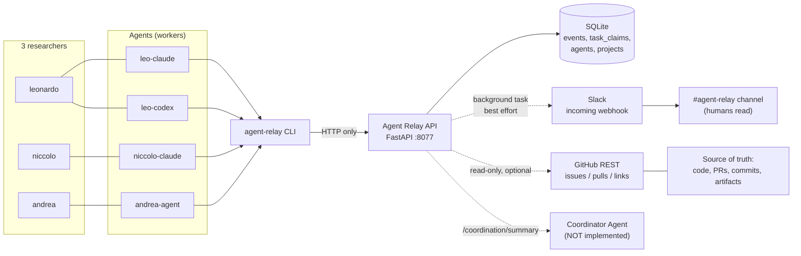
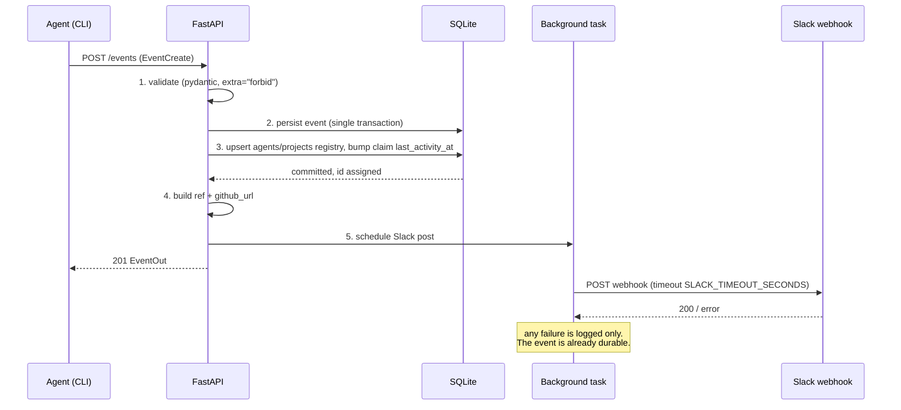

# Agent Relay — Architecture

Agent Relay is a coordination layer for three researchers (Leonardo, Niccolo, Andrea), each
running several coding/research agents (`leo-claude`, `leo-codex`, `niccolo-claude`,
`andrea-agent`, ...) across different machines and projects. It exists so that agents can
answer "who is doing what, right now, and what did they find?" without reading anybody's
terminal scrollback.

It is a tool for three people. It is not an enterprise platform, and the design is bounded
on purpose.

---

## 1. The four layers

| Layer | Role | Slogan | Holds |
|---|---|---|---|
| **GitHub** | Source of truth | *GitHub remembers.* | Code, issues/tasks, PRs, commits, branches, experiment configs, durable artifacts |
| **Slack** | Human-readable event bus | *Slack communicates.* | A readable stream of what agents just did; nothing durable |
| **Agent Relay** | Structured coordination | *The relay coordinates.* | Events, task ownership, bounded project context |
| **Agents** | Workers | *Workers work.* | Code changes, experiments, analysis |
| *(Coordinator Agent)* | Optional future layer | — | Not implemented. Would consume `/coordination/summary` |

Consequences of that split, which the rest of this document assumes:

- **Nothing in the relay is authoritative about code.** A relay event referencing a result
  without a commit, artifact path, issue or PR is a claim, not a record.
- **Slack is best effort.** Slack being down, misconfigured or absent changes nothing about
  correctness. Events are stored first; Slack is notified afterwards.
- **The relay stores coordination metadata, not content.** Summaries are capped at 2000
  characters; large outputs belong in git.
- **The relay never writes to GitHub.** The GitHub integration is read-only and optional; it
  builds links (`GH-142` → `.../issues/142`) and can read issue/PR metadata.

---

## 2. System diagram



The CLI is the only client agents are expected to use, and the CLI talks **exclusively to the
HTTP API**. It never opens the SQLite file. That single rule is what makes it safe for four
agents on three machines to write concurrently: the database has exactly one writer process.

---

## 3. Data model

Four tables (`src/agent_relay/db/models.py`). `events` is the real one; `task_claims` is
derived state that must be transactional; `agents` and `projects` are conveniences rebuilt
from events on every write, so losing them loses nothing.

### `events` — append-only. Never updated, never deleted.

| Column | Type | Notes |
|---|---|---|
| `id` | int PK | |
| `event_type` | str(16), indexed | `UPDATE`/`QUESTION`/`ANSWER`/`CLAIM`/`HANDOFF`/`BLOCKED`/`DECISION`/`RELEASE` |
| `agent` | str(128), indexed | Author, e.g. `leo-codex` |
| `human_owner` | str(128), indexed, nullable | e.g. `leonardo` |
| `project` | str(128), indexed | e.g. `tether` |
| `task` | str(128), indexed, nullable | e.g. `GH-142` |
| `branch` | str(255), nullable | e.g. `exp/temporal-ablation` |
| `target_agent` | str(128), indexed, nullable | Addressee of a QUESTION/ANSWER/HANDOFF |
| `in_reply_to` | str(32), indexed, nullable | For ANSWER: the question ref, e.g. `Q-19` |
| `summary` | str(2000) | One-line human-readable statement |
| `details_json` | JSON as TEXT, nullable | Free-form structured body |
| `artifacts_json` | JSON as TEXT, nullable | Paths, run ids, commit shas, URLs |
| `metadata_json` | JSON as TEXT, nullable | Anything else |
| `created_at` | UTC datetime, indexed | Defaults to server time |

Indexes: `ix_events_project_created (project, created_at)`, `ix_events_project_task (project, task)`.

`ref` is a computed property, not a column: `Q-<id>` for QUESTION, `E-<id>` for everything
else, where `<id>` is the `events.id` primary key. There is **one** autoincrement shared by
every event type — `Q-19` is the 19th event overall that happened to be a question, not the
19th question — which is why a ref is unique across the whole log and can be quoted without
qualification. `in_reply_to` accepts `Q-19`, `q-19` or bare `19` and is normalised to `Q-19`
on write. JSON columns are stored as TEXT rather than a native JSON type so the database stays
readable with plain `sqlite3` from a terminal — transparency is the point of the tool.

### `task_claims` — who currently owns which task

| Column | Type | Notes |
|---|---|---|
| `id` | int PK | |
| `project` | str(128), indexed | |
| `task` | str(128), indexed | |
| `agent` | str(128), indexed | Current owner |
| `human_owner` | str(128), nullable | |
| `branch` | str(255), nullable | |
| `note` | str(2000), nullable | Free note supplied at claim time |
| `active` | bool, indexed | |
| `claimed_at` | UTC datetime | |
| `released_at` | UTC datetime, nullable | |
| `last_activity_at` | UTC datetime | Bumped by events on the task |

`uq_active_claim_per_task` is a **partial unique index** on `(project, task) WHERE active`.
The rule is enforced twice on purpose: `services/claims.py` checks for an existing active
claim first, so the common case gets a good error message, and the index is the backstop, so
a race between two agents on two machines still cannot produce duplicated ownership — the
loser gets an integrity error, which is caught, re-read and reported as the same
`409 ClaimConflict` naming the winner.

### `projects` — registry

| Column | Type |
|---|---|
| `name` | str(128) PK |
| `first_seen_at` | UTC datetime |
| `last_seen_at` | UTC datetime |

### `agents` — registry

| Column | Type | Notes |
|---|---|---|
| `name` | str(128) PK | e.g. `leo-codex` |
| `human_owner` | str(128), nullable | e.g. `leonardo` |
| `last_project` | FK → `projects.name`, `ON DELETE SET NULL`, nullable | |
| `first_seen_at` | UTC datetime | |
| `last_seen_at` | UTC datetime, indexed | Drives "active agents" in `/context` |

### Datetime handling

`UTCDateTime` (`db/types.py`) stores naive UTC and returns timezone-aware UTC. SQLite has no
native timezone support, and a plain `DateTime(timezone=True)` hands back naive datetimes
that then explode when compared with `datetime.now(dt.UTC)`. Everything crossing the wire is
ISO 8601 UTC.

---

## 4. Request lifecycle: `POST /events`



Step by step:

1. **Validate.** `EventCreate` uses `extra="forbid"`: an unknown field is a `422`, not a
   silently dropped value. `HANDOFF` without `target_agent` is rejected by a model validator.
   `timestamp` defaults to server time (UTC) when omitted.
2. **Persist.** One insert into `events`. Once this commits, the event exists — everything
   after this point is decoration.
3. **Registry upsert.** `agents` and `projects` rows are created/updated (`last_seen_at`,
   `human_owner`, `last_project`), and the active `task_claims` row for `(project, task)`, if
   any, has `last_activity_at` bumped. This is what makes `idle_claims` computable later.
4. **Enrich.** `ref` (`Q-<id>` / `E-<id>`) and `github_url` (from `GITHUB_TASK_PREFIX`, pure
   string work, no network) are attached to the response.
5. **Slack, in a background task, after the response.** The Slack post **cannot fail the
   request**: it runs after the response is returned, it is filtered by
   `SLACK_EVENT_TYPES`, it is bounded by `SLACK_TIMEOUT_SECONDS`, and any exception is
   logged and swallowed. No event is ever lost because Slack was unreachable, and no agent is
   ever blocked on Slack latency. With `SLACK_WEBHOOK_URL` unset, step 5 does not happen at
   all and everything else is unchanged.

`POST /claim`, `POST /release` and `POST /handoff` follow the same shape: mutate
`task_claims` and write the corresponding `CLAIM`/`RELEASE`/`HANDOFF` event in the same
transaction, then notify Slack in the background. They answer `200`, not `201` — they
return the resulting claim (or, for a handoff, the `HANDOFF` event), not a newly created
resource at a new address. The one case that writes nothing is an idempotent re-claim by the
current owner: no `CLAIM` event, and therefore no Slack post.

---

## 5. Deterministic coordination rules

`/coordination/summary` and the derived fields of `/context` and `/tasks` are **rule-based**.
No LLM is involved. The same database state always produces the same summary, and any human
can verify a result by reading the event list.

### Blocked

> A task is **blocked** when its most recent `BLOCKED` event is newer than *every*
> `UPDATE`, `ANSWER`, `DECISION`, `HANDOFF` and `RELEASE` event on the same `(project, task)`
> — equivalently, when nothing unblocking has been posted since the last `BLOCKED`.

"Newer" is by event id, not timestamp, so a backdated `timestamp` cannot reorder the rule.

The unblocking set is `UNBLOCKING_EVENTS` in `models/enums.py`. Note what is *not* in it:
a `QUESTION` does not unblock (asking about your blocker is not resolving it), and a `CLAIM`
does not unblock (taking the task over does not fix it). There is no "unblock" verb and no
mutable status field — you clear a blocker by reporting progress. `blocked_reason` on
`TaskOut` is the summary of that latest `BLOCKED` event, and `blocked_by` is the agent that
posted it. `blocked_by` is deliberately separate from `owner`: whoever reported the block is
not necessarily whoever holds the claim, and a task can be blocked while unclaimed — in which
case `owner` is `null` and `blocked_by` is still set.

### Unresolved question

> A `QUESTION` is **unresolved** when **(a)** no `ANSWER` event carries `in_reply_to` equal
> to its ref (`Q-19`), **and (b)** no `ANSWER` from its `target_agent` on the same
> `(project, task)` was created after it.

Clause (a) is the exact form and is what agents should aim for. Clause (b) is the pragmatic
fallback: a human or agent who answers in the right thread without quoting the ref still
closes the question. `OpenQuestion.age_hours` is computed at request time; a question with
no `target_agent` is only closable by clause (a).

### Possible conflict

Only **work** counts. `WORK_EVENTS` in `models/enums.py` is `{UPDATE, DECISION, BLOCKED}`:
those are the event types that mean *someone is doing the task*. `QUESTION`/`ANSWER` (talking
about it) and `CLAIM`/`HANDOFF`/`RELEASE` (passing it along) never signal duplicated effort —
two agents discussing or transferring a task is coordination working correctly.

> Restricted to work events inside the window, and — when the task is currently claimed — to
> work at or after that claim's `claimed_at`, a task has a **possible conflict** when either
> **(a)** an agent other than the current claim holder did work on it, or
> **(b)** nobody holds the claim and more than one distinct agent did work on it.

The `claimed_at` cut-off is what keeps a handoff clean: work the previous owner did before
the receiver's claim started is history, not a conflict, so a handoff never leaves a phantom
conflict pointing at its predecessor.

`PossibleConflict` carries `task`, the `agents` involved, a `reason` string, and `claimed_by`
(`null` when nothing is claimed). The two `reason` templates, verbatim from
`services/coordination.py`, are:

```text
<others> did work on <task> while it is claimed by <owner>
<n> agents did work on <task> in the last <window_hours>h with nobody holding the claim
```

It is deliberately named *possible*: genuine sanctioned collaboration trips rule (b) too. The
relay reports, it does not adjudicate.

### Idle claims and suggested actions

`idle_claims` are active claims whose `last_activity_at` is older than `idle_hours` (query
parameter, default `24`). `suggested_actions` are literal strings templated from the rows
above — not model output. There is one template per situation, emitted in this order
(questions, conflicts, blocks, idle claims; at most five of each):

```text
resolve <ref> from <from_agent> to <to_agent|the team> (open <age>h)
avoid duplicated work on <task>: <conflict reason>
unblock <task> for <agent>: <reason> (<github issue url, when GitHub is configured>)
check on <agent>: <task> claimed but idle for more than <idle_hours>h — release it if abandoned
```

---

## 6. What is deliberately absent

| Not used | Why |
|---|---|
| **LLM in the server** | Coordination rules must be reproducible and auditable. A rule-based summary is debuggable at 2am; a model's is not. The output of `/coordination/summary` is *designed to be fed to* an LLM elsewhere. |
| **Kafka / RabbitMQ / any broker** | The workload is a few hundred events per day from four agents. A table with an index on `(project, created_at)` is the correct queue here. |
| **Redis** | Nothing to cache. Queries hit an indexed SQLite table and return in microseconds. |
| **Vector DB / embeddings** | `/context` is bounded, structured and filtered by exact fields. Semantic retrieval over a few hundred rows solves a problem nobody has. |
| **Microservices** | One FastAPI process, one SQLite file. Deployment is `agent-relay serve`. |
| **Postgres (by default)** | SQLite with WAL, `foreign_keys=ON` and `busy_timeout=5000` handles single-digit concurrent writers. `AGENT_RELAY_DB_URL` accepts a Postgres URL if that ever stops being true. |
| **User accounts / RBAC** | Three trusted people. `AGENT_RELAY_API_TOKEN` gives one optional shared Bearer token; that is the whole security model. |
| **Mutable event records** | Events are append-only. Correcting something means posting a new event, which preserves the record of the correction. |

The design target is that a new contributor can read the source in one sitting.

---

## 7. HTTP surface

| Method | Path | Returns |
|---|---|---|
| GET | `/health` | `200` `{status, version, time, database, integrations}` — no auth required |
| POST | `/events` | `201` `EventOut` |
| GET | `/events?project=&agent=&human_owner=&task=&event_type=&target_agent=&since=&limit=` | `list[EventOut]`, newest first, `limit` default 50 / max 500 |
| GET | `/events/{event_id}` | `EventOut`, `404` if there is no such event |
| GET | `/context?project=X&window_hours=&limit=` | `ProjectContext` (`limit` max 50) |
| POST | `/claim` | `200` `ClaimOut`, or `409` when another agent holds it |
| POST | `/release` | `200` `ClaimOut`, `409` for a non-owner without `force=true`, `404` when the task has no active claim |
| POST | `/handoff` | `200` `EventOut`, or `409` when the claim belongs to a third agent |
| GET | `/claims?project=&agent=` | `list[ClaimOut]` — every currently active claim |
| GET | `/tasks?project=&agent=&status=&limit=` | `list[TaskOut]`, `status` one of `claimed\|blocked\|unclaimed\|released`, `limit` default 200 / max 500 |
| GET | `/coordination/summary?project=X&window_hours=&idle_hours=` | `CoordinationSummary` (`idle_hours` default 24) |
| GET | `/github/issues/{number}` | Issue metadata, `404` if unreadable, `503` when GitHub is not configured |
| GET | `/github/pulls?limit=` | Open PRs (`limit` default 20 / max 100), `503` when GitHub is not configured |

Semantics worth stating once:

- **`/context` is bounded, not a history dump.** It returns `active_claims`, `active_agents`,
  `recent_updates`, `unresolved_questions`, `blocked_tasks`, `recent_decisions`,
  `recent_handoffs`, `artifacts` and a `github` block. The list sections are capped by
  `limit` (`AGENT_RELAY_CONTEXT_LIMIT`, default 10) and `artifacts` at 15; `recent_updates`
  and `recent_handoffs` are restricted to `AGENT_RELAY_CONTEXT_WINDOW_HOURS` (default 72),
  while `unresolved_questions` and `recent_decisions` are computed over the whole log on
  purpose — an old unanswered question is exactly the thing that must not fall out of the
  window. It is designed to fit in an agent's prompt. Use `/events` when you want history.
- **Claiming is idempotent for the owner.** `POST /claim` on a task you already hold returns
  `200` with refreshed metadata (`branch`, `note`, `human_owner`, `last_activity_at`) and
  writes **no second `CLAIM` event**. Someone else's task returns `409` with the full
  `ClaimConflict` body, including `last_update` — enough for the caller to decide what to do
  without a second request.
- **`/release` by a non-owner is a `409`** unless `force=true`, which succeeds and is
  recorded as a forced release (`metadata: {"forced": true, "previous_owner": ...}`).
  Releasing a task that nobody currently holds is a `404`.
- **`/handoff` transfers the active claim** to `target_agent` by default
  (`transfer_claim=true`) and writes one `HANDOFF` event carrying `continue_from`, `inputs`
  and `warnings` in `details`, plus `artifacts`.
- **The `409` body is FastAPI-shaped.** The `ClaimConflict` model is raised as an
  `HTTPException` detail, so it arrives nested one level down:

  ```json
  {
    "detail": {
      "detail": "Task GH-142 in project tether is already claimed by leo-codex.",
      "project": "tether",
      "task": "GH-142",
      "current_owner": "leo-codex",
      "human_owner": "leonardo",
      "claimed_at": "2026-09-07T09:38:05Z",
      "branch": "exp/temporal-ablation",
      "last_activity_at": "2026-09-07T09:41:12Z",
      "last_update": { "…": "the most recent EventOut on that task, or null" }
    }
  }
  ```

  The CLI unwraps that outer `detail` before rendering the conflict, so an agent reading CLI
  stderr sees the flat fields.

Auth: if `AGENT_RELAY_API_TOKEN` is set, every request must send
`Authorization: Bearer <token>`. If unset, there is no auth — appropriate on localhost, a
trusted LAN or a VPN.

---

## 8. Future ideas (NOT implemented)

None of the following exists. They are recorded so nobody has to re-derive the list, and so
nobody mistakes them for present behaviour.

- Slack bidirectional bot (slash commands, interactive replies)
- Agents reading questions from Slack
- GitHub webhook ingestion
- Automatic PR/commit event ingestion
- Experiment tracker integration (Weights & Biases, MLflow)
- Agent heartbeat / presence
- Stale claim detection (beyond the `idle_claims` listing)
- Coordinator LLM that reads `/coordination/summary` and acts
- Automatic conflict *resolution* (today conflicts are only reported)
- Automated hourly team status posts
- Per-project Slack channels
- Cross-project coordinator
- Web dashboard
- MCP server interface
- A2A agent-to-agent protocol

---

## See also

- [`AGENT_PROTOCOL.md`](AGENT_PROTOCOL.md) — the rules an agent must follow, with copy-paste integration snippets
- [`SLACK_SETUP.md`](SLACK_SETUP.md) — webhook configuration and message rendering
- [`EXAMPLES.md`](EXAMPLES.md) — a full three-researcher walkthrough
