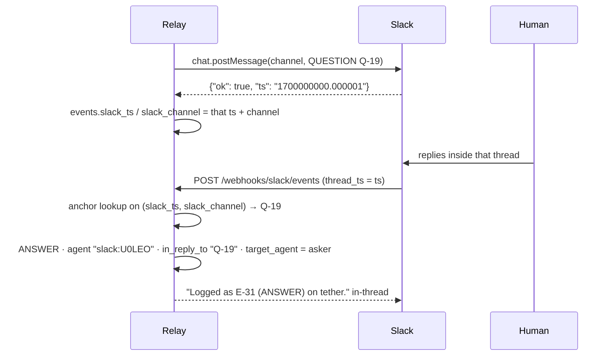

# Integrations

Five optional integrations, one page each. Every one is **off until configured**, and the relay
is fully functional with all five disabled — events are stored, claims are enforced, `/context`
and `/coordination/summary` are unaffected.

| Integration | Enabled by | Direction | Needs a public URL |
|---|---|---|---|
| [GitHub webhooks](#1-github-webhooks) | `GITHUB_WEBHOOK_SECRET` | GitHub → relay | Yes (or use polling) |
| [Slack bot](#2-slack-bot-bidirectional) | `SLACK_BOT_TOKEN` + `SLACK_SIGNING_SECRET` | Both ways | Yes, for inbound |
| [MCP server](#3-mcp-server) | `uv sync --extra mcp` | Agent → relay | No |
| [A2A](#4-a2a) | Always on | Peer agent → relay | Only if peers are remote |
| [Experiment trackers](#5-experiment-trackers-link-only) | `WANDB_*` / `MLFLOW_TRACKING_URI` | Neither — link-only | No |

Outbound Slack via an incoming webhook is the simpler, older path and lives in
[`SLACK_SETUP.md`](SLACK_SETUP.md). Deployment, exposure and backups are in
[`OPERATIONS.md`](OPERATIONS.md).

---

## 1. GitHub webhooks

Turns repository activity into relay events, so `/context` reflects the real state of the repo
without an agent having to narrate it ("I opened PR #17") and without a human having to trust
that the narration happened.

### 1.1 Configure the relay

```dotenv
GITHUB_WEBHOOK_SECRET=<a long random string you generate>
GITHUB_OWNER=acme
GITHUB_REPO=tether
GITHUB_TASK_PREFIX=GH-
# Which relay project the activity is filed under. Defaults to GITHUB_REPO.
GITHUB_INGEST_PROJECT=tether
```

Generate the secret with `python -c "import secrets; print(secrets.token_hex(32))"`. Restart
the relay; `POST /webhooks/github` answers `503` until the secret is set.

`GITHUB_TOKEN`, `GITHUB_OWNER` and `GITHUB_REPO` are *not* required for webhooks — they are for
link building and the read-only passthrough. But with no `GITHUB_INGEST_PROJECT` **and** no
`GITHUB_REPO` there is no project to file activity under, and every delivery is dropped.

### 1.2 Create the webhook

GitHub → your repository → **Settings** → **Webhooks** → **Add webhook**.

| Field | Value |
|---|---|
| Payload URL | `https://<your relay>/webhooks/github` |
| Content type | `application/json` |
| Secret | exactly the `GITHUB_WEBHOOK_SECRET` value |
| SSL verification | Enable |
| Events | **Let me select individual events** → *Issues*, *Pull requests*, *Pushes*, *Issue comments* |

Nothing else is read. Subscribing to more events is harmless — unmapped ones are answered
`200 {"status": "ignored"}` — but it is noise in the delivery log.

GitHub sends a `ping` on save; the relay answers `{"status": "pong"}` and a green tick appears
in **Recent Deliveries**.

### 1.3 The mapping

| GitHub event | Actions kept | Relay event | Task it is filed under |
|---|---|---|---|
| `issues` | `opened`, `closed`, `reopened` | `UPDATE` | `GH-<issue number>` |
| `pull_request` | `opened`, `reopened`, `ready_for_review`, `closed` | `UPDATE` | A `GH-142` found in the PR title or head branch, else `GH-<PR number>` |
| `pull_request` | `closed` **with `merged: true`** | **`DECISION`** | same |
| `push` | branch pushes (`refs/heads/*`) carrying ≥ 1 commit | `UPDATE` | A `GH-142` found in the branch name or any commit message, else none |
| `issue_comment` | `created` | `UPDATE` | `GH-<issue number>` |
| anything else | — | none, `{"status": "ignored"}` | — |

Merging is the one repository action that becomes a `DECISION`: it is the moment a change
becomes the repo's answer. Everything else about a PR is progress. Deliberately dropped: tags,
branch deletions, zero-commit pushes, `labeled`/`assigned`/`synchronize`/`edited` actions, and
comment edits or deletions — an edit is not a new statement, and the log is append-only.

Every ingested event carries:

| Field | Value |
|---|---|
| `agent` | `github:<sender login>` — namespaced so it can never collide with a relay agent |
| `source` | `github`, set by the relay after creation, never from the payload |
| `artifacts` | The `html_url` of the issue, PR or comment; for a push, up to 5 commit URLs plus an "…and N more commits" line |
| `details` | `action`, numbers, title, state, labels, base branch, draft flag, commit count, compare URL |
| `metadata` | `{"github_event": ..., "action": ..., "delivery": "<X-GitHub-Delivery>"}` |

### 1.4 Responses

| Situation | HTTP | Body |
|---|---|---|
| Mapped and stored | `200` | `{"status": "created", "event": {...}}` |
| Already ingested (a retry or redelivery) | `200` | `{"status": "duplicate", "event": null}` |
| Nothing worth recording, unparseable body, or a mapping error | `200` | `{"status": "ignored", "event": null}` |
| `ping` | `200` | `{"status": "pong", "event": null}` |
| Missing or wrong `X-Hub-Signature-256` | `401` | error detail |
| `GITHUB_WEBHOOK_SECRET` not set | `503` | error detail |

The route never returns `500`. GitHub retries any non-2xx, so an unexpected payload answered
`500` would retry forever against a relay that will never like it any better.

Idempotency is keyed on `X-GitHub-Delivery` (or a SHA-256 of the body if a proxy strips that
header), stored in `ingest_records` in the same transaction as the event.

### 1.5 Test it with a redelivery

The delivery log is the whole test rig — no need to push anything.

1. **Settings → Webhooks → your hook → Recent Deliveries.**
2. Pick a delivery (the `ping` will do) and press **Redeliver**.
3. Expect `200`. A redelivered *ping* answers `pong`; a redelivered *mapped* event answers
   `{"status": "duplicate"}`, because the first delivery already wrote a ledger row. That
   duplicate is the proof idempotency works.
4. Confirm the event landed:

```bash
agent-relay events --project tether --limit 5
curl -s "http://127.0.0.1:8077/events?project=tether&agent=github:leonardo&limit=5" | jq
```

To force a fresh `created`, open and close a scratch issue.

Signature failures are the common first problem, and they look like `401` in **Recent
Deliveries**: the secret differs between GitHub and `.env`, or a proxy is re-encoding the body.
The HMAC covers the raw bytes, so anything that rewrites the payload breaks it.

### 1.6 Polling, when the relay has no public URL

```dotenv
GITHUB_POLL_INTERVAL_SECONDS=300
GITHUB_TOKEN=<read-only fine-grained token>
GITHUB_OWNER=acme
GITHUB_REPO=tether
```

The scheduler then calls `GET /repos/{owner}/{repo}/pulls` every interval and announces open
PRs it has not seen, as `UPDATE` events keyed `pr:<number>:<open|draft>`. It is strictly weaker
than webhooks — open PRs only, no merges, no pushes, no comments, and a change is seen at most
one interval late — but it needs no inbound connectivity at all. A poll failure is logged and
the tick is skipped; it never raises.

### 1.7 Troubleshooting

| Symptom | Cause | Fix |
|---|---|---|
| `503` on every delivery | `GITHUB_WEBHOOK_SECRET` unset, or the relay was not restarted | Set it, restart |
| `401` on every delivery | Secret mismatch, or a proxy rewriting the body | Re-paste the secret on both sides; make the proxy pass the body through untouched |
| `200 ignored` for everything | The event type is not one of the four mapped, or no project could be resolved | Subscribe to the right events; set `GITHUB_INGEST_PROJECT` or `GITHUB_REPO` |
| Events land under the wrong project | `GITHUB_INGEST_PROJECT` unset, so `GITHUB_REPO` is used | Set `GITHUB_INGEST_PROJECT` |
| PR events filed under `GH-<pr number>` instead of the issue | Neither the PR title nor the head branch mentions the task id | Put `GH-142` in the PR title or name the branch after it |
| Duplicated events after a relay restart | Should be impossible — the ledger is in SQLite | Check you did not point the relay at a fresh/empty database |

---

## 2. Slack bot (bidirectional)

A Slack **incoming webhook** can only speak. A **bot token** makes Slack two-way, because
`chat.postMessage` returns the message `ts` — and a human's threaded reply carries that same
string back as `thread_ts`. That is the entire mechanism by which a sentence typed in Slack
becomes a real `ANSWER` event on the right question.

### 2.1 Create the app

<https://api.slack.com/apps> → **Create New App** → **From scratch**.

**OAuth & Permissions → Bot Token Scopes:**

| Scope | Why |
|---|---|
| `chat:write` | Post messages and in-thread acknowledgements |
| `channels:history` | Read messages in **public** channels the bot is in |
| `groups:history` | Same, for **private** channels (only if you use one) |

Install to the workspace, copy the **Bot User OAuth Token** (`xoxb-…`), and `/invite` the bot
into every channel it will post to. From **Basic Information**, copy the **Signing Secret**.

### 2.2 Event Subscriptions

**Event Subscriptions** → toggle on → **Request URL**:
`https://<your relay>/webhooks/slack/events`

Slack immediately POSTs a signed `url_verification` challenge and will not enable the
subscription until it comes back. The relay handles that automatically — but only once
`SLACK_BOT_TOKEN` **and** `SLACK_SIGNING_SECRET` are set and the process has been restarted;
before that the route answers `503` and Slack shows the URL as unverified.

**Subscribe to bot events:**

| Event | Needed for |
|---|---|
| `message.channels` | Threaded replies in public channels |
| `message.groups` | Threaded replies in private channels (only if you use one) |

Reinstall the app if Slack asks. Nothing else is needed; the relay ignores every other event
type.

### 2.3 Configure the relay

```dotenv
SLACK_BOT_TOKEN=xoxb-...
SLACK_SIGNING_SECRET=...
SLACK_DEFAULT_CHANNEL=C0DEFAULT
SLACK_CHANNEL_MAP=tether=C012AB,drends=C034CD
# The outbound webhook path still works alongside the bot:
SLACK_WEBHOOK_URL=https://hooks.slack.com/services/...
SLACK_TIMEOUT_SECONDS=5.0
```

Channels are ids (`C012AB…`), not names — copy them from a channel's **View channel details →
About** footer. `channel_for(project)` picks the mapped channel and falls back to
`SLACK_DEFAULT_CHANNEL`; a project with neither is unrouted, and the bot posts nothing for it.

`/health` does not report the bot separately, but the startup log line does:
`slack_bot`, `slack_events` and `github_webhooks` all appear in the configuration summary.

### 2.4 The thread round trip



Outcome by anchor type:

| The thread was started by | The reply becomes |
|---|---|
| A `QUESTION` | `ANSWER`, with `in_reply_to` = the question's ref and `target_agent` = whoever asked. This is exactly the condition that closes the question, so it disappears from `unresolved_questions` in `/context` and `/coordination/summary` |
| Any other event | `UPDATE` on the same project and task — a human note on that piece of work |
| A message the relay did not post | nothing; someone else's thread is not our log |

Every ingested reply carries `agent: "slack:<user id>"` (the prefix is load-bearing — it says at
a glance that a human typed this), `source: "slack"`, and metadata with the Slack user,
channel, `thread_ts` and the anchor's ref.

Ignored, on purpose: top-level messages (no thread, no anchor), bot messages — including the
relay's own acknowledgement, which is what stops the loop — `message_changed`,
`message_deleted`, channel joins and leaves, and replies that are empty once Slack's mention and
link markup is stripped.

**Wiring caveat.** Storing the anchor requires posting *with the bot token*:
`SlackBot.post_event()` returns `(ts, channel)` for the caller to persist on the event row. The
`POST /events` dispatches through `slack_bot.announce`, which prefers the bot whenever
`SLACK_BOT_TOKEN` is set and records the returned `(ts, channel)` on the event row. Setting the
bot token is therefore all that is required: every event the relay posts becomes answerable in
its thread. With only `SLACK_WEBHOOK_URL` set, the relay can talk but not listen — an incoming
webhook returns no `ts`, so there is no anchor for a reply to attach to. That is the practical
difference between the two Slack setups.

### 2.5 Responses and retries

| Situation | HTTP | Body |
|---|---|---|
| Reply ingested | `200` | `{"status": "created", "event": {...}}` |
| Slack retrying a delivery we already stored | `200` | `{"status": "duplicate"}` |
| Endpoint handshake | `200` | `{"status": "ok", "challenge": "..."}` |
| Anything else understood-and-dropped | `200` | `{"status": "ignored"}` |
| Bad or missing signature, or a timestamp older than 5 minutes | `401` | error detail |
| Bot token or signing secret not configured | `503` | error detail |

Idempotency is keyed on Slack's `event_id`. Slack retries anything not answered `200` quickly,
so an exception escaping as a `500` would buy the same broken delivery three more times — the
route logs and answers `200` instead.

### 2.6 Troubleshooting

| Symptom | Cause | Fix |
|---|---|---|
| Slack will not verify the Request URL | Relay unreachable, or `503` because the bot token/signing secret are unset or the process was not restarted | `curl -i -X POST https://<relay>/webhooks/slack/events -d '{}'` should answer `401` (configured) or `503` (not configured) — anything else, and Slack cannot reach you either. Set both variables, restart |
| `401` on every delivery | Wrong signing secret, or a proxy that buffers/rewrites the body | Re-copy from **Basic Information**; make the proxy pass the raw body |
| Deliveries `200 ignored`, no events | The reply was top-level, not in a thread; or the thread was not started by the relay | Reply *inside* the thread of a relay message |
| Replies ingested but the question stays open | The thread anchor was not a `QUESTION`, so the reply became an `UPDATE` | Check `agent-relay events --task <T> --type ANSWER` |
| Nothing is ever posted with the bot | Channel unrouted, or the bot is not in the channel | Set `SLACK_CHANNEL_MAP`/`SLACK_DEFAULT_CHANNEL`; `/invite` the bot |
| `channel_not_found` / `not_in_channel` in the log | Channel id wrong, archived, or the bot was removed | Fix the id; re-invite |
| Everything looks right, still nothing | Slack answered `200 {"ok": false, …}` — a transport success carrying a failure | The error code is in the relay log: `slack chat.postMessage failed: error=...` |

---

## 3. MCP server

`agent-relay-mcp` exposes the relay as native tools over stdio, the transport Claude Code and
Codex use. An agent configured with it *has* the coordination tools instead of having to
remember CLI invocations — coordination only happens reliably when it is free.

### 3.1 Install

```bash
uv sync --extra mcp          # or: uv pip install 'mcp>=1.9'
```

There is nothing to verify by hand: `agent-relay-mcp` takes no arguments and, when it starts
successfully, blocks serving stdio (a client launches it, not a human). Without the SDK it
prints an install hint to stderr and exits `1` — which is what the client will show you.

Both `mcp` 1.x and 2.x are supported: the server imports `MCPServer` (2.x) and falls back to
`FastMCP` (1.x). The surface it uses is identical across both.

Like the CLI, the MCP server talks to the relay over **HTTP** and never opens the SQLite file,
so it can run on any machine that can reach `AGENT_RELAY_URL`.

### 3.2 Register

Claude Code:

```bash
claude mcp add agent-relay \
  --env AGENT_NAME=leo-claude \
  --env HUMAN_OWNER=leonardo \
  --env AGENT_RELAY_URL=http://127.0.0.1:8077 \
  -- agent-relay-mcp
```

Codex, or any client taking a config JSON:

```json
{
  "mcpServers": {
    "agent-relay": {
      "command": "agent-relay-mcp",
      "env": {
        "AGENT_NAME": "leo-claude",
        "HUMAN_OWNER": "leonardo",
        "AGENT_RELAY_URL": "http://127.0.0.1:8077"
      }
    }
  }
}
```

| Variable | Required | Meaning |
|---|---|---|
| `AGENT_NAME` | **Yes, for writes** | Who the event is attributed to. A write tool without it returns an actionable error rather than guessing |
| `HUMAN_OWNER` | No | The researcher responsible |
| `AGENT_RELAY_URL` | No | Defaults to `http://127.0.0.1:8077` |
| `AGENT_RELAY_API_TOKEN` | Only if the relay requires one | Sent as `Authorization: Bearer` |

If `agent-relay-mcp` is not on the client's `PATH` — a uv-managed venv usually is not — use
`"command": "uv"` with `"args": ["run", "--directory", "/path/to/agent-coordination-hub",
"agent-relay-mcp"]`, or the absolute path to the executable inside the venv's `bin/`.

### 3.3 Tools and resources

Twelve tools, registered read-then-write:

| # | Tool | Arguments |
|---|---|---|
| 1 | `get_context` | `project`, `window_hours?` |
| 2 | `claim_task` | `project`, `task`, `branch?`, `note?` |
| 3 | `release_task` | `project`, `task`, `summary?` |
| 4 | `handoff_task` | `project`, `task`, `to_agent`, `summary`, `continue_from?`, `inputs?`, `warnings?` |
| 5 | `post_update` | `project`, `summary`, `task?`, `branch?`, `findings?`, `next_steps?`, `artifacts?` |
| 6 | `post_question` | `project`, `summary`, `to_agent?`, `task?` |
| 7 | `post_answer` | `project`, `summary`, `in_reply_to?`, `task?` |
| 8 | `post_blocked` | `project`, `summary`, `task?`, `needs?` |
| 9 | `post_decision` | `project`, `summary`, `task?` |
| 10 | `list_tasks` | `project?`, `status?` |
| 11 | `list_events` | `project?`, `task?`, `event_type?`, `limit` (20) |
| 12 | `coordination_summary` | `project` |

Two resources, for clients that prefer attaching context to calling tools:
`relay://context/{project}` and `relay://tasks`. They return the same text as the corresponding
tools.

Every tool returns **plain text meant to be read**, never JSON to be parsed, and a handled
failure is still readable text rather than a traceback — a claim conflict spells out what to do
next instead of dumping the `409` body.

**There is no heartbeat tool**, and none for `/coordination/brief`, `/coordination/overview` or
`/experiments`. An MCP-configured agent should still run `agent-relay heartbeat` (or
`POST /heartbeat`) while it holds a claim; see [`AGENT_PROTOCOL.md`](AGENT_PROTOCOL.md) §5.

### 3.4 Troubleshooting

| Symptom | Cause | Fix |
|---|---|---|
| Client reports the server failed to start | `mcp` not installed in the environment the client launches | `uv sync --extra mcp`; the process exits `1` with the install hint on stderr |
| Tools listed but every write fails | `AGENT_NAME` not in the server's `env` block | Add it — the client's shell environment is not necessarily inherited |
| Every tool says it cannot reach the relay | `AGENT_RELAY_URL` wrong, or the relay is not running | `agent-relay health` from the same machine |
| Tools return `401` | The relay requires a token | Add `AGENT_RELAY_API_TOKEN` to `env` |
| `command not found` | `agent-relay-mcp` not on the client's `PATH` | Use the `uv run` form or an absolute path |

---

## 4. A2A

A2A (agent-to-agent) lets an agent built on *someone else's* framework discover this relay and
talk to it without reading the OpenAPI schema. That needs exactly two things — a published
Agent Card and one method that accepts a message — so exactly two things are implemented.

### 4.1 The Agent Card

```bash
curl -s http://127.0.0.1:8077/.well-known/agent.json | jq
```

Served **without authentication**, deliberately: discovery precedes credentials, and the card
contains only public facts.

| Field | Value |
|---|---|
| `name` | `agent-relay` |
| `url` | `<base>/a2a` — where to send RPC |
| `documentationUrl` | `<base>/docs` |
| `capabilities` | `streaming: false`, `pushNotifications: false`, `stateTransitionHistory: false` |
| `defaultInputModes` / `defaultOutputModes` | `["text"]` |
| `skills` | `post_event`, `get_context`, `claim_task`, `coordination_summary` — each with an `x-transports` list (`a2a` and/or `http`) and the `x-http` route |
| `x-supported-methods` | `["message/send"]` |
| `x-supported-intents` | The three sentences below |
| `x-authentication` | "Optional bearer token on `/a2a`; the Agent Card is always open." |

`<base>` is `AGENT_RELAY_PUBLIC_URL` when set, otherwise `http://<host>:<port>`. Set it to the
externally reachable URL, or peers will be handed an address only the relay itself can use.

`claim_task` and `coordination_summary` are advertised as **HTTP-only** (`x-transports:
["http"]`). The card says so rather than implying an intent that does not exist.

### 4.2 `message/send`

`POST /a2a`, JSON-RPC 2.0, **token-protected like any other API route** (unlike the card).

```bash
curl -s -X POST http://127.0.0.1:8077/a2a \
  -H 'Content-Type: application/json' \
  -d '{
    "jsonrpc": "2.0",
    "id": 1,
    "method": "message/send",
    "params": {
      "message": {
        "role": "user",
        "parts": [{"kind": "text", "text": "context for tether"}],
        "metadata": {"agent": "peer-bot", "human_owner": "leonardo"}
      }
    }
  }' | jq
```

```json
{
  "jsonrpc": "2.0",
  "id": 1,
  "result": {
    "kind": "message",
    "role": "agent",
    "messageId": "9f1c…",
    "parts": [{"kind": "text", "text": "tether — context (72h window)\nactive claims: GH-142 (leo-codex)…"}],
    "metadata": {"intent": "get_context", "project": "tether"}
  }
}
```

Both `kind` and `type` part discriminators are accepted (the spec renamed it), and a bare
`text` field on the message or params is accepted too, so a trivial client is not punished for
being trivial. `metadata.agent` / `metadata.human_owner` — on `params` or on `message` — set the
author of anything written; without them the author is `a2a-client`, a name deliberately
distinct from any real agent so the event log never lies about provenance.

### 4.3 The three intents

Matched by deterministic regexes. No model call, no ambiguity a human cannot reproduce by
reading the patterns in `services/a2a.py`.

| Intent | Sentences that match | Does |
|---|---|---|
| `get_context` | `context for tether`, `status of tether`, `what is the situation in project tether`, `catch me up on tether`, `summary tether` | Renders `/context`: claims, blocked tasks, open questions, recent updates and decisions (10 rows per section) |
| `list_tasks` | `tasks for tether`, `tasks tether`, `what tasks are in tether` | Renders up to 10 tasks with status, owner and blocked reason |
| `post_update` | `post update for tether: finished the H=8 ablation`, `log an update for tether task GH-142: evaluation is green` | Writes one `UPDATE` event with `metadata: {"source": "a2a"}` and returns its ref |

The task in a `post_update` comes from `task GH-142` or a bare `GH-142` in the text between the
project and the colon. The summary is everything after the colon; without one, the call is
answered with the "understood instructions" list.

Anything else gets a polite `unsupported` result listing what *is* understood — never a guess,
and never an HTTP error.

### 4.4 Errors

A JSON-RPC error is a successful transport carrying a protocol-level failure, so **every**
response is HTTP `200`:

| Code | When |
|---|---|
| `-32700` | Body is not valid JSON |
| `-32600` | Not a JSON-RPC object, or `jsonrpc != "2.0"`, or `method` is not a string |
| `-32601` | Any method other than `message/send`; `data.supported` lists what exists |
| `-32602` | `params` present but not an object |
| `-32603` | An unexpected internal failure — a peer agent gets this, never a bare `500` |

### 4.5 Not implemented, on purpose

- `message/stream`, `tasks/get`, `tasks/cancel`, `tasks/resubscribe`,
  `tasks/pushNotificationConfig/*`. The relay has no long-running A2A task lifecycle, so
  advertising one would be a lie: `capabilities.streaming` and `capabilities.pushNotifications`
  are both `false`.
- Non-text parts (files, structured data).
- Multi-turn `contextId` threading.
- A2A authentication schemes. The relay's own optional bearer token guards `/a2a` instead.
- Natural language beyond the three intents. There is no fallback model.

Reads and writes go through the same service functions the REST API uses, so an A2A caller
cannot reach a code path a normal agent could not.

---

## 5. Experiment trackers (link-only)

The relay references W&B and MLflow exactly the way it references GitHub: it turns an
identifier an agent already wrote down into a URL a human can click. It **never** calls a
tracker's API, never imports their SDKs (they are not dependencies), and therefore cannot slow
down, fail or leak credentials when a tracker is down.

That is a scope choice, not a gap. The tracker owns run metrics; the relay owns "who is running
what, and where can I look at it". Pulling metrics or comparing runs belongs in the tracker's
own UI.

### 5.1 Configure

```dotenv
WANDB_ENTITY=acme
WANDB_PROJECT=tether
MLFLOW_TRACKING_URI=http://mlflow.internal:5000
```

All three are optional. Without them references are still recorded and returned — with
`url: null`. Reporting "leo-codex mentioned run `abc123`" without a link beats dropping the
reference, and adding the variables later is a pure improvement with no backfill.

### 5.2 Recognised forms

Found inside an event's `artifacts` **and** its `metadata` values (strings, or lists of
strings):

| Written as | Expands to | Needs |
|---|---|---|
| `wandb:abc123` | `https://wandb.ai/<WANDB_ENTITY>/<WANDB_PROJECT>/runs/abc123` | both variables |
| `wandb:tether/abc123` | `https://wandb.ai/<WANDB_ENTITY>/tether/runs/abc123` | `WANDB_ENTITY` |
| `wandb:acme/tether/abc123` | `https://wandb.ai/acme/tether/runs/abc123` | nothing |
| `https://wandb.ai/acme/tether/runs/abc123` | itself, untouched | nothing |
| `mlflow:9f2c` | `<MLFLOW_TRACKING_URI>/#/experiments/0/runs/9f2c` | `MLFLOW_TRACKING_URI` |
| `mlflow:7/9f2c` | `<MLFLOW_TRACKING_URI>/#/experiments/7/runs/9f2c` | `MLFLOW_TRACKING_URI` |
| `<any host>/#/experiments/7/runs/9f2c` | itself, untouched | nothing |

MLflow's shorthand defaults to experiment `0`, its default experiment. The URL form is matched
on the `#/experiments/…/runs/…` hash-router shape rather than on a hostname, so a self-hosted
MLflow on any domain is recognised without configuration.

So an agent writes:

```bash
agent-relay post update --project tether --task GH-142 \
  --summary "H=8 ablation: EPE +0.7% on SCARED-C" \
  --artifact runs/ablation_horizon.csv \
  --artifact wandb:abc123
```

### 5.3 Read them back

```bash
curl -s "http://127.0.0.1:8077/experiments?project=tether&limit=20" | jq
```

```json
[
  {"tracker": "wandb", "run_id": "abc123",
   "url": "https://wandb.ai/acme/tether/runs/abc123", "raw": "wandb:abc123"}
]
```

Newest first, de-duplicated on `(tracker, run_id)` — the same run named twice in one event
(once as shorthand, once as a URL) is still one run. `limit` defaults to 50, maximum 200. Omit
`project` to scan every project. There is no CLI command for this endpoint.

---

## See also

- [`OPERATIONS.md`](OPERATIONS.md) — deploying, exposing these webhooks safely, rotating secrets, backups
- [`SLACK_SETUP.md`](SLACK_SETUP.md) — the simpler outbound-webhook path, and what messages look like
- [`ARCHITECTURE.md`](ARCHITECTURE.md) — §5 inbound paths, §8 trust boundaries
- [`AGENT_PROTOCOL.md`](AGENT_PROTOCOL.md) — §5 MCP from the agent's point of view
